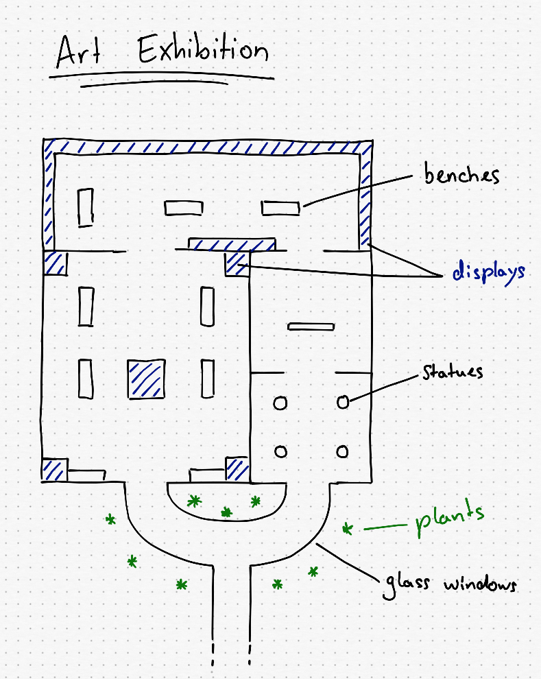

# Planning a Track

<!-- MarkdownTOC autolink='true' -->

- [Introduction](#introduction)
- [Collecting Ideas](#collecting-ideas)
- [Planning the Track](#planning-the-track)
- [The Flow](#the-flow)
- [Planning the Layout](#planning-the-layout)

<!-- /MarkdownTOC -->

## Introduction

The most important thing is to not overestimate yourself and the capabilities of the game. Re-Volt has been around for more than a decade. You won’t get any amazing next-gen graphics out of it and some mechanics are just not possible. Back then, proper texturing and lighting (manually, of course!) did the job.

## Collecting Ideas

Planning the track is probably the most demanding task. Take your time and think for a few days about possible themes and details. Always carry a small notebook to write your thoughts down (nowadays you can do that with your smartphone, of course). Write everything down immediately as it comes to your mind; Anything that could be helpful for your track. Even the smallest detail might help you in the end. You might think that you will remember later but you won’t. No matter how small your idea is, just write it down!

The next step is to find reference pictures and google for some hours. Try different search terms for your track theme. You should also check out sites like deviantArt or Flickr. Create a folder on your desktop and save everything in there. Here are my references for the track I will be making throughout this guide:

<a href="http://imgur.com/a/ZkEV6">Chinatown References</a>

If you think you got a solid idea, think about it once more. Do you have every inch of the track planned out? Do you think they could work in the game? It is really important to have a rock solid plan for your track. It will make modeling it much easier.  
Some people might be able to just start modeling without much planning, making up parts of the track as they go.

If you're planning to do an indoor track, you can check out Google Maps. There is a [list of indoor maps](https://support.google.com/maps/answer/1685827) that you can check out to gather some inspiration.

## Planning the Track
Categorize your ideas. Some examples are: Track flow, special elements (such as escalators, long jumps, underwater parts, …) and details. Write them down in a table with columns reaching from fundamental elements to little graphical details. This table will help you building up the actual plan. 
When you’re done collecting your ideas, try to organize them in an order. A fun idea is to cut all of them out and put them on a table, then arrange them in an interesting order.

## The Flow

A very fundamental part of it is the flow itself. The flow describes the path the cars take on a track and how well it's driveable. It can be smooth with a lot of curves and aids that help you to keep in line or rather rough with some edges and obstacles. A good flow is not necessarily smooth. Some people might enjoy a little challenge.

Venice is a pretty hard track for beginners but offers a fun challenge for online races. You're easily pushed into the canals if you don't pay attention. The narrow bridge part integrates well into the track theme which makes up for its difficutly.  
Just don’t put any unnecessary obstacles in your track (any narrow parts that are just there to make the track harder), but implement obstacles in your overall theme of the track. A hull breach in a space ship that sucks you out into space? That sounds cool. A random spot in the track where you’re just lifted up into the air? Way more likely to be annoying.

The perfect flow is actually up to personal preference. A good example however are stock tracks since most people enjoy them. Ask yourself: What do I like about tracks? What do I hate about them? What do I hate although it’s a funny challenge and worth implementing?

If you mess up the flow, there is little reason for people to play your track. Re-Volt is not a game for showing off your graphics (although some quite nice things can be done). I advise you to not rush or skip this part and do the flow on the fly. Take your time and optimize it where you can. Make your track original and interestingly challenging.

## Planning the Layout

_Can you suggest any tool for planning a track_? Pen and Paper. It’s still the most efficient way to put your ideas down. Take a look at your list of track elements and put them together. Make sure to distribute them all over the track. You should avoid any entirely boring parts. Think about Holiday Camp here. It has that long part where you’re just heading back to the start line. It’s not too bad but it gets boring over time.

If you have trouble finding a proper layout for your track, just have a look at stock tracks from above (You can search for maps on Re-Volt Frontend for some track renderings). It’s no shame to copy some elements from them.

When you have an acceptable flow, start finding places for your special track elements and details. Don’t be vague about this. It will help you immensely if you have a proper map on paper that you could already race on. Don’t leave anything out!

Before proceeding you should have a nice plan of your track. Take your time and rework it a few times. It saves a lot of work to have an accurate map. If you have one, it’s going to be easy to model your track!

Here are some old maps of my first track:

For this tutorial, I'm going to use this one:

> The more detailed your plan is, the easier it will be to model the track.