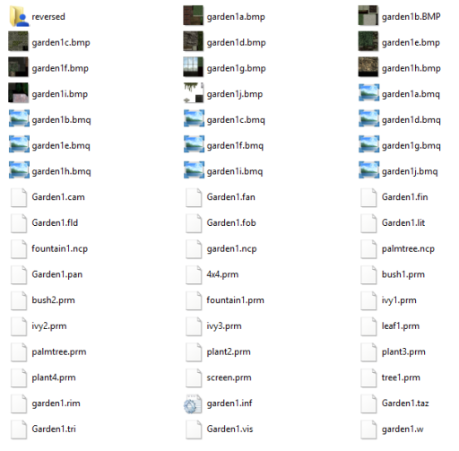

# Track Files

Let’s take a look at garden1’s folder structure. You won’t have to do anything in this step. This is just so you know what a track looks like.

You will find these file types in many tracks:

`reversed` folder  
This folder includes files that will be used in case the player chooses to race it backwards.

`<trackname><letter>.bmp`  
There can be 10 bitmaps, named gardena.bmp to gardenj.bmp in this case.

`<trackname><letter>.bmq`  
You will have noticed that there are similar files to the bitmaps we were just looking at. These are called mipmaps. They are used by the game and will be used on object that is further away in order to make the textures look smoother. Modern game engines do this automatically, and, in fact, if you are planning to make the track just for RVGL, you don’t need to worry about those.

`<trackname>.cam`  
This file contains camera nodes that Re-Volt uses for the replay.
 
`<trackname>.pan`  
This file contains the POS nodes.
    
`<trackname>.fan`  
This file contains the AI nodes.
  
`<trackname>.fin`  
This contains information about instances (decorative objects).
    
`<trackname>.fld`  
A file for force fields. These can alter the gravity or provide wind effects.
    
`<trackname>.fob`  
Object file for pickups and other interactive objects.
    
`<trackname>.lit`  
This contains the lights. Some extra lighting effects can be achieved like shadows on cars and objects.
    
`<trackname>.rim`  
This one contains simple geometry to tell the game where mirrors are. These are used for reflective floors.
    
`<trackname>.inf`  
Information file for tracks. It contains, for example, the start position, music path, fog color, etc.
    
`<trackname>.taz`  
Track zones, used to determine if a car went through all parts of the track.
    
`<trackname>.tri`  
Triggers: These are used for the direction arrows and repositioning of the car.
    
`<trackname>.vis`  
Visiboxes are used for performance optimization: Hiding parts of the tracks that cannot be seen anyway based on where the car is. These are optional but can improve performance.
    
`<trackname>.w`  
The 3D model of the track. We will create this one with Blender.
 
`<trackname>.ncp`  
Collision and surface data. Also done with Blender.

`properties.txt`  
A text file that contains track properties like materials and effects (optional). You can read about its options in the [RVGL Documentation](https://yethiel.gitlab.io/RVDocs/#track-properties-properties.txt)

In the game’s folder, there is a folder called `gfx`. We will need to put a bitmap in there later which will be used to show a preview picture in the track selection. It will be named like the track folder you have chosen. We will create this file and all the others listed above in the following steps.