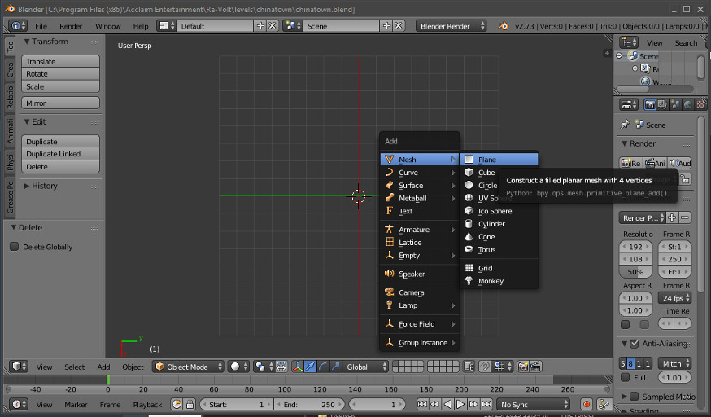

# First Steps with Blender

<!-- MarkdownTOC autolink='true' -->

- [Watch Tutorials first](#watch-tutorials-first)
- [Creating objects and moving the camera](#creating-objects-and-moving-the-camera)
- [Move, Rotate and Manipulate Objects](#move-rotate-and-manipulate-objects)
	- [Advanced manipulation](#advanced-manipulation)
- [Conclusion](#conclusion)

<!-- /MarkdownTOC -->

## Watch Tutorials first

> Blender can get extremely complex if you're not used to similar programs. **I highly recommend watching this tutorial if you've never seen Blender or worked with it before**:  
[https://cgcookie.com/lesson/first-steps-with-blender/](https://cgcookie.com/lesson/first-steps-with-blender/)

> _It's like a sports car, many people will bin it on their first tries, but if you take the time to learn to drive it's a blast._

<cite>- Gotolei</cite>

## Creating objects and moving the camera

Start Blender and load your level file. First you should get used to Blender's viewport controls. For this, it is wise to create an object to focus on, first. I can't tell you everything here so you will need to use your intuition a bit. Blender has a very steep learning curve. I recommend looking up some basic Blender tutorials if you're having trouble with this step.

**Getting some things clear**: (You don't need to understand this right away, use it as a reference at a later point)
+ Blender can be used to create 3D objects. This space has 3 axes: X, Y and Z. For us, the positive Z axis is up, the positive X axis is right and the positive Y axis is forward.
+ We are going to create objects. These objects have a point of origin (center) which can be represented by a position vector (x, y, z), e.g. with (3, 5, 0). 
+ All objects are made of multiple triangles (polygons). In our case, each polygon will have 3 or 4 vertices (corner points). Most of our polygons will be quads (quadratic polygons with four vertices/points). Note that quads are also made of two triangles. If you have a quad that is non-planar (not flat), you will need to split it into two triangles (more about this later).

You can see a red-white circle in the view port: It's the *3D cursor*. This is where new objects will be created. To center it, press **SHIFT + C**.
To add an object, press **SHIFT A** and select *Plane*. A new plane object should show up:

Try out the following keys:

> I will be using some abbreviations:  
**LMB**: Left mouse button  
**RMB**: Right mouse button  
**MMB**: Middle mouse button  

| Keyboard | Action |
|----------|--------|
| LMB | Set cursor |
| CTRL + LMB and then drag | Lasso selection |
| SHIFT + B | Square selection |
| RMB | Select object. Selected objects will be outlined in orange |
| Numpad Period | Focus on selected object |
| MMB | Pan around focused object |
| Scroll | Scoll in and out, direction depends on your selected object |
| SHIFT + MMB and drag around | Drag around the view |

There are many more hotkeys and key combinations. However, for the basics, it's well enough.

## Move, Rotate and Manipulate Objects

One object is not enough. Often it's wise to split your track into multiple parts, or you just want to create an object that is not fixed to the main road. For this, you can either create new objects or duplicate your existing ones. Try out the following actions:

| Keyboard | Action |
|----------|--------|
| SHIFT + A | Open *add* menu |
| SHIFT + D | Create duplicate of an object |
| ALT + D | Create duplicate of an object (Geometry will be shared. If you edit one object, the duplicates will change, too.) |
| SHIFT + RMB | Select multiple objects (main selection bright orange, all other objects dark orange) |
| DELETE or X | Delete an object |
| S | Scale an object |
| G | Grab and move an object |
| R | Rotate an object |

### Advanced manipulation

Now you can move, rotate and scale objects. You can also do all of these actions along a specific axis. 
For example, if you wish to scale an object only in height, press **S** and after that, press **Z**. This way you can select the axis.
If you only want want to scale it on the X and Y axis, press **S** and then **SHIFT + *the axis you don't want***. Then move your mouse and click the **LMB** or **ENTER** to confirm, or **ESC** to dismiss the tool.

You can also specify by how much you want to scale/rotate/translate. After initiating scale and selecting your axis, type a number (blender units or degrees, depending on what you're doing.) A 90 deg. rotation around the Z axis would be **S -> Z -> 90**. Moving your object up by 3 blender units (BU) would be **G -> Z -> 3**.

## Conclusion

Now you should know how to create objects and move them around. These objects will contain the geometry of your track. You could create one object for the base geometry and then many small objects for decoration and things that will be represented more than once.

These basics will also help you in the next step in which we will take a look at the *Edit Mode*. This mode allows you to change the geometry of objects.