# Edit Mode

<!-- MarkdownTOC autolink='true' -->

- [Getting your Map inside Blender](#getting-your-map-inside-blender)
- [Editing an Object](#editing-an-object)
	- [Vertex Select](#vertex-select)
	- [Edge Select](#edge-select)
	- [Face Select](#face-select)
	- [Select Linked](#select-linked)
	- [Add](#add)
	- [Subdivide](#subdivide)
	- [Extrude](#extrude)
	- [Make a Face/Edge](#make-a-faceedge)
	- [Loop Cut and Slide](#loop-cut-and-slide)
	- [Merge](#merge)
	- [Cut](#cut)
	- [Straighten](#straighten)
	- [See Geometry through Objects](#see-geometry-through-objects)
- [Warnings](#warnings)
- [Workflow](#workflow)
	- [Creating Parts separately and merging them](#creating-parts-separately-and-merging-them)
	- [Extrusion and the Magnet Tool](#extrusion-and-the-magnet-tool)
	- [Flip Normals](#flip-normals)
	- [Zip-Snapshot 02](#zip-snapshot-02)
	- [Dealing with non-planar Polygons](#dealing-with-non-planar-polygons)
	- [Placeholders](#placeholders)
	- [Filling in the placeholders](#filling-in-the-placeholders)
	- [Zip-Snapshot 03](#zip-snapshot-03)
- [Conclusion](#conclusion)

<!-- /MarkdownTOC -->

In this step we will take a look at Blender's Edit Mode. You will be able to edit the objects that you created in the last step. We will actually start modeling our track now.  
Modeling requires a lot of practice and you will need to find your own workflow. The only thing I can do here is to show you one way of modeling basic things. The main point of the tutorial is to show you how to use Blender in conjuction with Re-Volt. There are many modeling tutorials out there. **I recommend watching some basic tutorials on YouTube first**. If you trust your intuition, you can also go ahead and read this page, it's not *too* hard if you've used some other rather complex programs.

## Getting your Map inside Blender

You surely want to model along your map that you created.

Go to the Blender Preferences and enable the *Import Images as Planes* plugin (Go back [here](/tracks-and-modeling/setup#blender) if you forgot how to enable plugins. You don't need to install it, only activate it, since it comes with Blender).

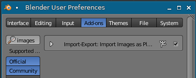

Now go to **File -> Import -> Images as Planes** and select your map.

This will give you a plane, you should not be able to see the texture. To fix this, enable *Textured Solid* in the right sidebar (you can toggle the right sidebar with **N** and the left one with **T**):

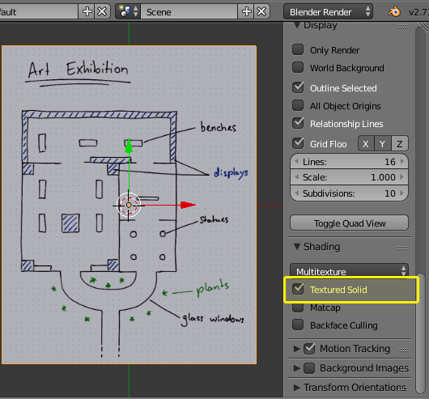

Now it is time to **scale the map up**. We can change the scale later but it is important to have it somewhat right. 
To do that, select the map with the **Right** mouse button so it's outlined in orange (as in the screenshot above). Then press **S** on the keyboard and move your mouse. Apply with **ENTER**, discard with **ESC**. (You can also use the mouse buttons to confirm or dismiss changes when scaling.)

For my track, this seems alright (compare it with the grid):

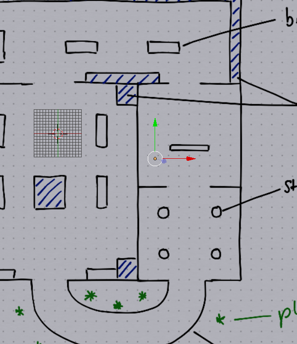

> **Advanced Tip**: Import a stock track and compare it to your plan. Go to **File -> Import -> Re-Volt** and choose a track that is roughly the size of your track. The select your map object and scale/rotate it accordingly. If you are satisfied, select your map object and press **CTRL I** to invert your selection. This way you will have the imported stock track selected which you can now delete with **DELETE**.

Now move the map so that your desired start/finish line is centered on the main grid (I have already done that on the last screenshot). The positive Y-axis (green arrow) is the forward direction. The screenshot above shows an example. This way we don't need to specify the starting position in the **.inf** file (don't worry, you'll be able to adjust this at any point of time).

## Editing an Object

Set your cursor to a part of your track you want to work on (click on your map to move the cursor there) and add a Plane. Feel free to focus on your newly created object with **NUMPAD PERIOD**. 
Now press **TAB** to enter *Edit Mode*. 
Here I'll show you some of the basic techniques that you can use to model your track geometry. There are many ways of doing this, so feel free to try out what works for you (as long as you stick to the [rules](#warnings) further down this page).

### Vertex Select
You will see the objects vertices now. Blender defaults to vertex mode by default. Select a vertex and move it around. It works just like the Object mode covered in the previous step. Now select two vertices and try to scale them. You will see that the center of scaling is the median point of the two vertices (the middle). Now select a third one and rotate them. If you're feeling comfortable with that, move on to the next mode. If not, keep experimenting.

### Edge Select
Switching modes is easy. There is a bar of three buttons located at the bottom of the viewport: 
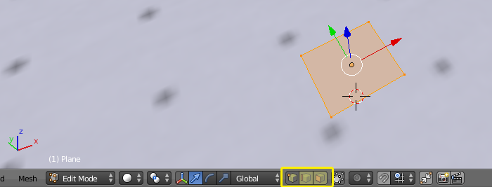
Click the center button to enable edge select. Just like with the vertex selection mode, you can now select edges of your object (two vertices at once, so to speak).

### Face Select
You can also select entire faces (the area contained by vertices and edges). It is the third button located on the same bar.

With these selections, you can perform the same actions as with the objects. You can scale, rotate, translate, duplicate, ...
Now there are some more tools to edit the geometry of objects. I will list the most important ones below and explain how they are used:

### Select Linked
To select everything that is linked, i.e. all that belongs to a mesh, press **CTRL + L**. This is handy if you have a lot of geometry in one object. You can then move, delete or do other things with the selection.

### Add
You can still add an **mesh** to the **object** you're currently editing: **SHIFT + A**. It's just like in the object mode.

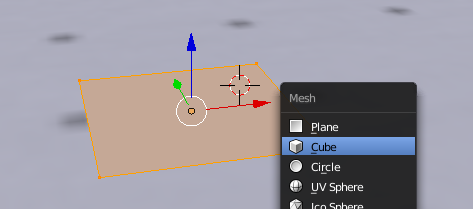

### Subdivide
Press **W** and then **S** to subdivide your selection.

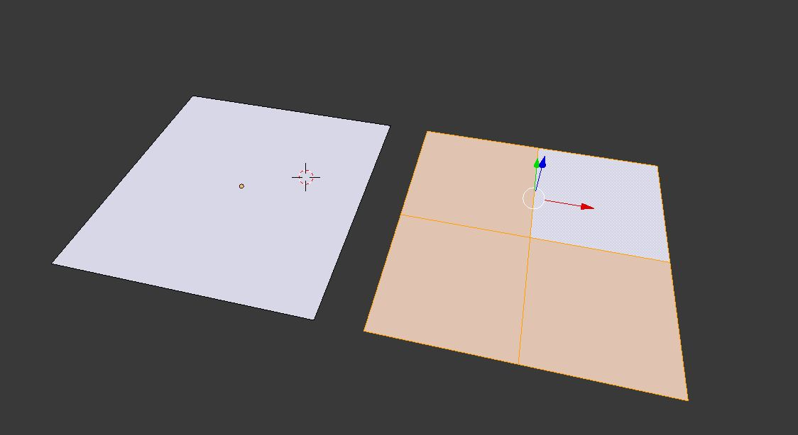

### Extrude
Select a vertex, edge or face and press **E**. New geometry will pop out along the normal axis of the selected thing. If you don't want to move it, press **ESC** or **RMB**. It will still be extruded. but you will be able to move it yourself. If you want to undo, press **CTRL Z** as usual.

### Make a Face/Edge
To fill in a face or edge from selected vertices or edges, press **F**

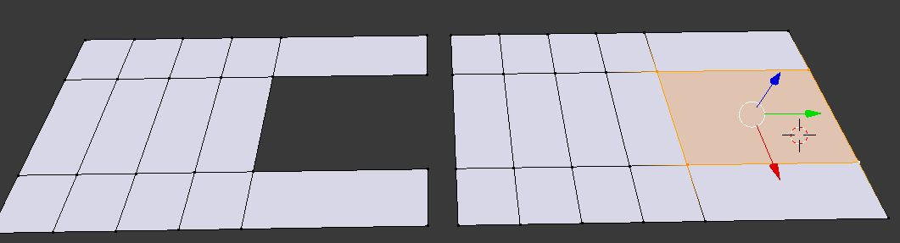

### Loop Cut and Slide
Press **CTRL + R** and then scroll to adjust the number of cuts. **LMB** to confirm. Then you will be able to move the cut. Move and confirm with **ENTER** or **LMB**, alternatively press **ESC** or **RMB** to not move the cut.
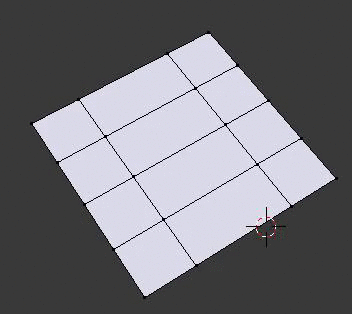

### Merge
You can merge two vertices by selecting them and pressing **ALT + M**. Alternatively, you can also select them and scale them to 0. Then you'd need to remove double vertices by pressing **SPACE** and searching for *Remove Doubles*.

### Cut
Sometimes it's necessary to cut some polygons to get a more quadratic shape out of them so mapping a texture onto them will be easier later. An example can be seen here where I cut some triangles into the mesh to connect the two rooms with a door and a threshold. In Edit Mode, press **K** and then click on parts of the mesh you want to cut. Confirm with **ENTER**. In the example below, I'm creating the green lines by cutting there. (You can watch this technique on [YouTube](https://youtu.be/sxuiw1u5mmg?t=7m3s))

### Straighten
If you have a face or an edge that is not straight and you want to level it/bring it to one height, select the vertices in question and scale them to 0 along the Z (or any other) axis. This way, you can align anything you want along a line.

### See Geometry through Objects
There is a handy little function that lets you see through objects. You'll be able to select all the polygons, even the ones that would otherwise be hidden by other geometry/objects.
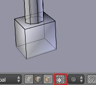

## Warnings

**Before you actually start editing, you need to keep a few things in mind** (Don't be scared. If you get something wrong or don't understand something, you can always get help on the forums.):
+ **Save often and create backups!**
+ The more polygons you have, the more it is going to lag in-game. Keep your track under 60,000 polygons.
+ Keep the geometry simple! If your track has simple geometry, players will have more fun racing it.
+ Keep your quads square! A quad should be 'as big' as the texture you're planning to use with it. You cannot tile textures, you can only tile polygons. Import (File -> Import -> Re-Volt) a stock tracks if you don't understand. You will see that there are many square polygons used for surfaces that largely have the same texture. This is a technical limitation, I will explain it further at a later point. If you have sections with too large polygons, subdivide or cut them so that they _fit_ the textures.
+ [Learn how to deal with non-planar polygons.](#dealing-with-non-planar-polygons) Planar quads are easier to work with.

## Workflow

If you felt brave and got stuck anyway, you can still [watch the following steps on YouTube](https://youtu.be/sxuiw1u5mmg)

I started tracing the track by adding a plane, extruding, rotating, subdividing, ...

I added one plane, scaled it up and subdivided it. Then I extruded parts and transformed them into the other rooms using the techniques mentioned above.

### Creating Parts separately and merging them
Some parts can be modeled as separate meshes and then merged. Here I cut some polygons to fit another part of the track using the knife tool. Then I will merge them with **ALT + M**:

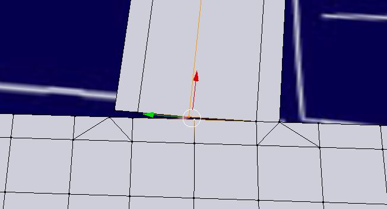

New parts start as a long plane that can be subdivided or cut:

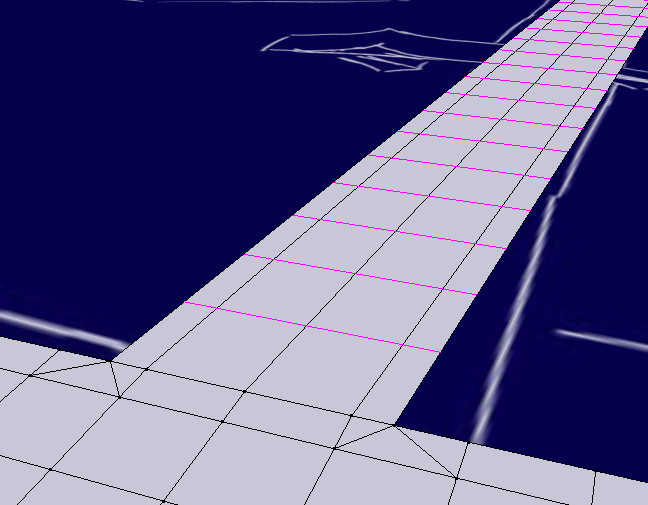

Combining all the techniques explained above, i copied parts and merged them with other parts. Now most of the track is outlined. It doesn't need to be *too* clean as we will polish everything in the end. Just make sure that you have no double vertices (remember: remove doubles) and that everything is connected nicely. Everything is flat at the moment (to flatten: select everything and scale Z to 0).

### Extrusion and the Magnet Tool
I then started extruding walls and other things from the rooms that I modeled. A very useful tool is the magnet. You can find it in the bottom toolbar of the viewport (in the marked dropdown list, select Vertex):

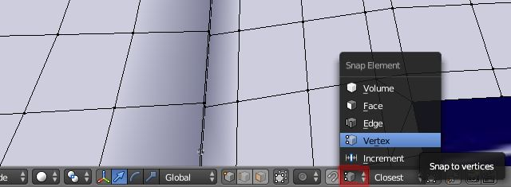

You can activate the magnet tool by either clicking on the magnet or holding down **CTRL**. Now you can select a row of edges, extrude it and then move it, point to the vertex you want to snap to, click when it snaps to the right vertex. If not, press **ESC** and start moving the edges again, this time with your mouse cursor placed somewhere else. You'll get the hang of it. For example, you can get all walls to be the same height with this.

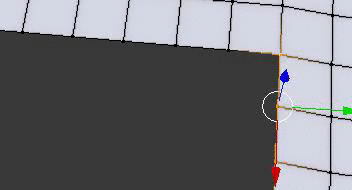

### Flip Normals 

(invisible polygons, wrong normal direction)

Sometimes it can happen that your polygons are the wrong way around. They are shaded differently:

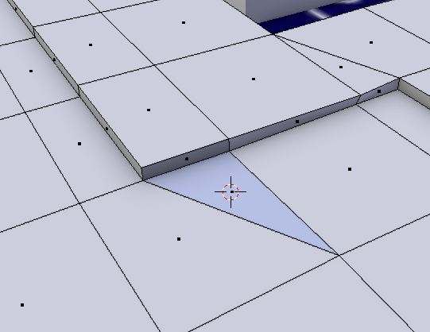

To make those polygons easier to spot, enable *Backface Culling* in the right sidebar and polygons will only be visible from their *up*-side:

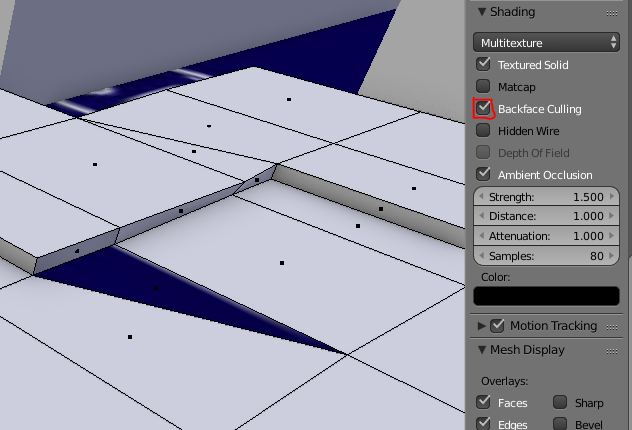

To flip a polygon around, select it and use the *Flip Direction* function in the left sidebar:

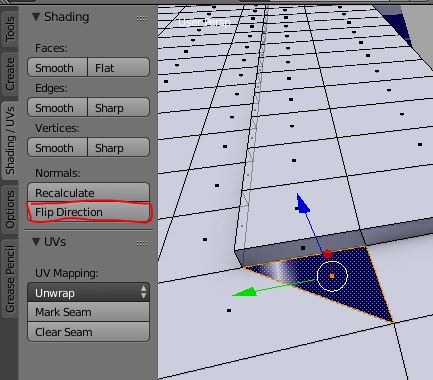

Your polygon should now be facing the right direction:

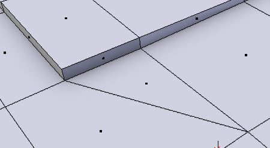

Remember, you can select multiple polygons while holding down **SHIFT**.

### Zip-Snapshot 02
If you're stuck, here is my current level folder:

[Download Zip File](track_snapshot02.zip)

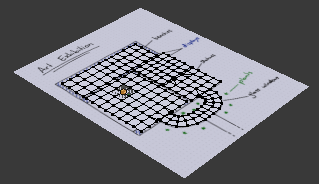

### Dealing with non-planar Polygons
How to spot non-planar faces:

| planar | non-planar |
|-|-|
| 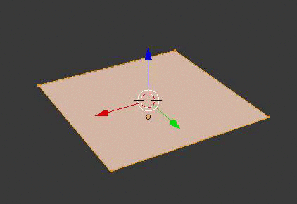 | 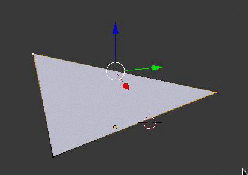 |

Always pay attention to non-planar polygons (remember, they can be split in two ways). Re-Volt does not like quads that are not straight. If they are non-planar, you will need to split them (if cars will drive on them). The best way to do it is selecting the two opposing vertices and pressing **J** (this will split quad faces to tris). Here is an example of the ambiguity (Blender might split it the way you don't want):
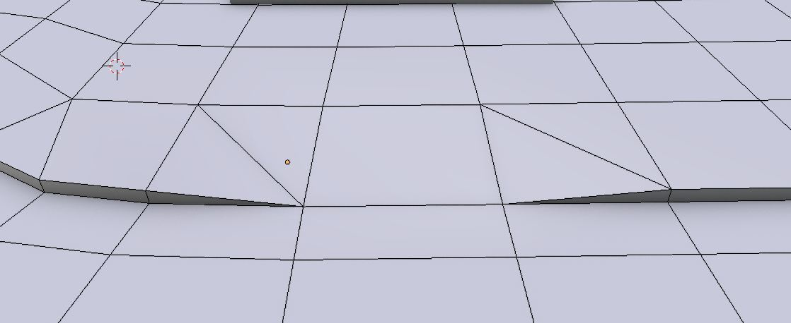

If you have a large selection of non-planar polygons, for example on a bumpy hill or a lawn, you can select all of them and then press **CTRL + T**. This will triangulate them automatically.

### Placeholders
I am planning to model some parts of the track later, mostly decorational objects. I changed to object mode by pressing **TAB** and created a few cubes, rotated and scaled them the way I want. Later, I will replace them with proper meshes.

### Filling in the placeholders
[YouTube: Placing Placeholders](https://youtu.be/Thte7eVJUy0)

When you're done modeling a solid base for the cars to drive on, you can start filling in more detailed objects. You can just place new objects (**Shift + A**, make sure that you are in Object mode by pressing TAB and checking the bottom bar of the view port). Then you can get rid of the placeholder objects. All those objects can be separate, they'll all be exported to the track file. It's recommended to keep the base in one object, though. It's best to have one solid mesh for the cars to drive on.

### Zip-Snapshot 03
If you're stuck, here is my current level folder:

[Download Zip File](track_snapshot03.zip)

## Conclusion
At the end of this step you should have a mesh of your track (mostly done, you can polish it later, of course). If you're doing this for the first time: Take your time, start over if you don't like your results. It's a steep learning curve that is tackled easiest in small bits. It also helps to import some simple models from the game and then remodel them. See how you can improve your workflow. Feel free to use google or ask on the forums if you are stuck! There are lots of ways to do things.

The next step is to texture the track. If you have come this far, congratulations! There is still a long way to go but I am sure you learned a lot.