# Creating Textures

<!-- MarkdownTOC autolink='true' -->

- [File Formats](#file-formats)
- [Mip Maps](#mip-maps)
- [Rules and Tips](#rules-and-tips)
- [Gathering Textures](#gathering-textures)
- [Gimp](#gimp)
- [Creating new Files](#creating-new-files)
- [Scaling Layers](#scaling-layers)
- [Duplicating Layers](#duplicating-layers)
- [Merging Layers](#merging-layers)
- [Altering Colors](#altering-colors)
- [Drop Shadows](#drop-shadows)
- [Save](#save)
- [Working with Selections](#working-with-selections)
- [Zip-Snapshot 04](#zip-snapshot-04)
- [Exporting Textures](#exporting-textures)
- [More Textures](#more-textures)
- [Conclusion](#conclusion)

<!-- /MarkdownTOC -->


In this step, we will create textures for the track.  
First, some theory.

### File Formats
Re-Volt uses 10 _texture pages_ with a naming scheme of `track*.bmp` where `*` is a letter ranging from a to j (ten of them).  
The .bmp textures should have a size of 256x256. Depending on the version of Re-Volt, the resolution can be higher. Beginning with Re-Volt 1.2, you can use larger texture sizes. [Check the wiki](http://wiki.re-volt.io/articles/texture-formats) to find out which sizes and formats are available. If you're going for a high resolution, you should stick to 1024 or 2048 since larger texture might have a negative impact on the track's performance.

### Mip Maps
For my example track I will be using 512x512 texture pages. During development, I will name them `artsa.bmp, artsb.bmp, ..., artsj.bmp`. I will need to rename them to `*.bmo` later since `*.bmp` should be used for 256x256 textures:

```
-------- Size ------------ File --------
      8192 x 8192   -   texture.bmk  (near)
      4096 x 4096   -   texture.bml
      2048 x 2048   -   texture.bmm
      1024 x 1024   -   texture.bmn
       512 x 512    -   texture.bmo
     [ 256 x 256    -   texture.bmp ]
       128 x 128    -   texture.bmq
        64 x 64     -   texture.bmr
        32 x 32     -   texture.bms
        16 x 16     -   texture.bmt
         8 x 8      -   texture.bmu
         4 x 4      -   texture.bmv
         2 x 2      -   texture.bmw
         1 x 1      -   texture.bmx   (far)
```

You may have noticed the `*.bmq` files in the Re-Volt levels. They have a size of 128x128. What are they for? Those smaller textures are called mip maps. They will be used for objects that are further away from you. This way your track will look a lot smoother. You can also go into the other direction and use larger versions of your textures for objects that are *near*. That's what I'm doing. However, it is wise to start work with the largest resolution you're intending to use.  

> I chose to work with a base resolution of 512x512 pixels. That means that I will have three files per texture page: `.bmo`, `.bmp`, `.bmq.`.  
Creating those mipmaps is one of the last steps. While working on the track, I will use 512x512 files called `*.bmp`.  
Also, you can save your textures as .png and rename them to .bmp, RVGL will read them. That's what I am going to do.

### Rules and Tips
Refer to them later, you might not understand them yet if you're new to 3D modeling. Re-Volt is a pretty old game. So here are some things to keep in mind:

+ UV coordinates must be between 0 and 1 for both axes. This means that you cannot tile textures (as explained earlier in the tutorial). If you map them out of bounds, they will glitch out.
+ Pure black RBG(0, 0, 0) will be transparent (if you use the default settings and 16bit bitmaps)
+ There are no normal/specular or other special maps. All your details need to be on the texture page. You may also want to include detailed shadows in the textures.
+ Brightness of the level can be manipulated with vertex paint. If your level is set at night, you don't necessarily need to use dark textures.

### Gathering Textures
A few pages earlier I linked you some texture resources. Download textures you like and extract them to a folder in your working directory. We will use them to compose our texture pages. These are some of the ones I chose. We'll also create some textures from scratch or get some new ones if we need more.

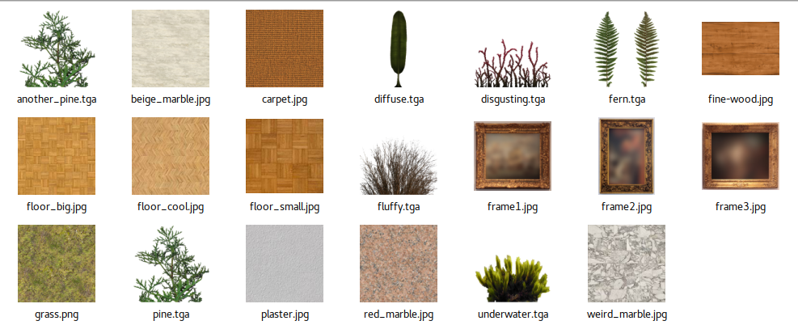

## Gimp

If you're completely unfamiliar with programs like GIMP, you can watch [a part of this tutorial on YouTube](https://youtu.be/HhrxF4kzuYE).

The first step is to enable the Single-Window Mode (it's much more convenient). To do so, open the Window menu from the menu bar and select _Single-Window Mode_.
### Creating new Files
Create a new file by pressing **CTRL N**. You'll be greeted with this:

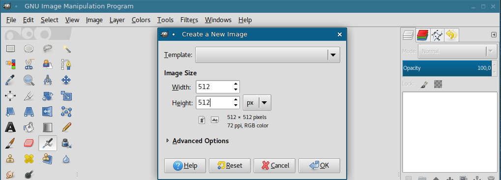

Set the resolution to 512x512 (or any power of 2 above 256) and confirm.

### Scaling Layers

Now you can just trag a texture from your ressources folder into the program. 

You can **zoom** in and out using the **scroll wheel** while holding down **CTRL**.

The first thing I want to do is scale it down to take up only a quarter (256x256) of the texture. Click on the scale tool and then on the layer. A window will pop up.

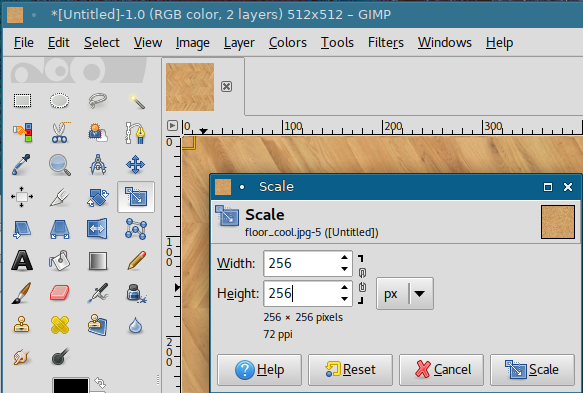

After that you'll want to move it into a corner of our texture. Use the _Move_ tool and grab the layer. It might be outside the canvas (still highlighted by the black-yellow outline). Just move it the top left edge so it aligns with the canvas' edges.

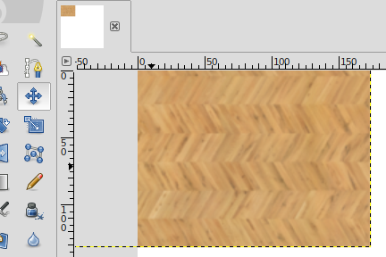

### Duplicating Layers
So that is one part of the texture page. I also want a carpet on it, so I'll duplicate the current layer since I need to put the carpet on it. To duplicate a layer, right click it in the right side bar and click on **Duplicate Layer**.

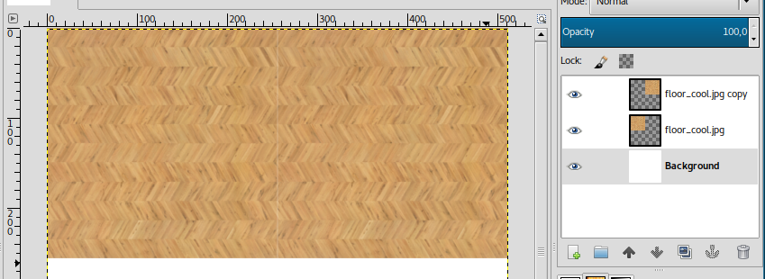

### Merging Layers
Now I dragged the carpet texture into GIMP and scaled it down to 128x128 to only take up a quarter of the wooden floor (as described above). I then duplicated it again and put it beneath it another time to have a larger strip. Then, select the topmost carpet layer from the list, right-click it and select _Merge Down_. We'll then have a larger carpet layer.

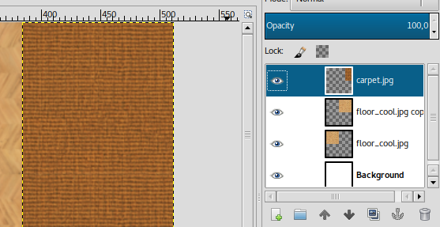

### Altering Colors
Now, I have to admit, the carpet is a bit ugly. Select the layer and go to **Colors -> Hue/Saturation**. Adjust the Hue slider until you found something you like.


### Drop Shadows
It still looks a bit bland, I know. How about a subtle shadow under the carpet? Go to **Filters -> Light -> Drop Shadow** and adjust it to your liking.

|  Drop Shadow Window  | Result  |
|  :-----          |  :-----          |
| 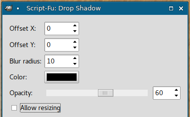 | 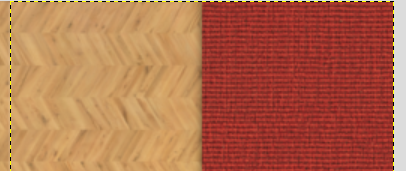 |

### Save
It's time to save. Hit **CTRL S** and save it as `tracknamea.xcf`, I'll save it as `artsa.xcf`. We'll export to PNG/BMP later.

### Working with Selections
The shadow goes a bit beyond the wood part of the texture. I want to get rid of the shadow that sticks into the white part. Select the layer and activate the selection tool. Then select the part that's not on the wood and press **DELETE**. To unselect, press **CTRL SHIFT A**.

|  Shadow goes too far  |  Selection Tool  |  Result  |
|  :-----          |  :-----          |  :-----          |
|  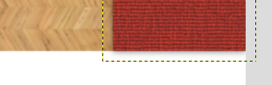 |  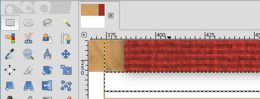 |  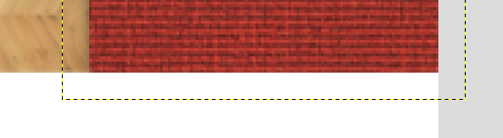 |

### Zip-Snapshot 04

If you're stuck, here is my current level folder: 

[Download Zip File](track_snapshot04.zip)

### Exporting Textures
I added a few more textures to the texture page and it's now full. To export it, press **CTRL SHIFT E** and export it as a PNG file.

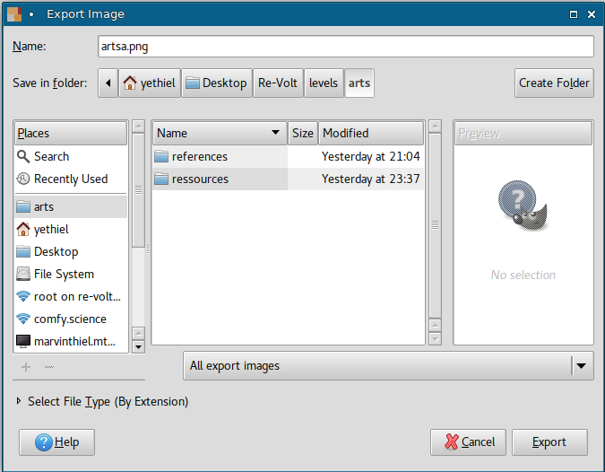

! To make the game recognize the texture, you need to rename the .png file to .bmp. (It's still a .png file, it just has the name of a .bmp file). `artsa.png` --> `artsa.bmp`

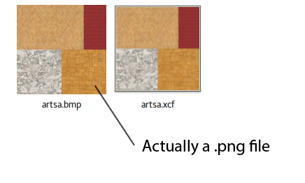

### More Textures
One texture page won't be enough. While modeling the track further, I made some textures for the walls (artsb.bmp and artsc.bmp). Check out how I made them on [YouTube](https://youtu.be/aTEIB234OUo). (This video will be referenced in the next step again, so don't be shocked if you see some Blender things that you don't understand yet.)

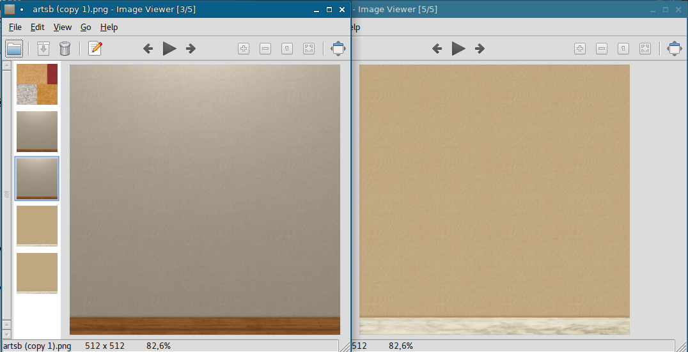

### Conclusion

You don't need to create _all_ texture pages right now. I actually created only the first one and moved on to mapping and modeling the track a bit more. I made some walls higher and did some more adjustments. You can always come back to earlier steps later. In fact, we will create more sophisticated textures in a later step again (_Creating Textures (Advanced)_). In the next step, we'll put the texture we just made onto the 3D objects we modeled.