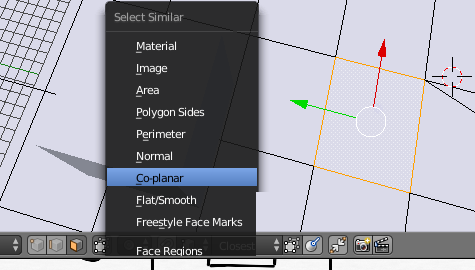
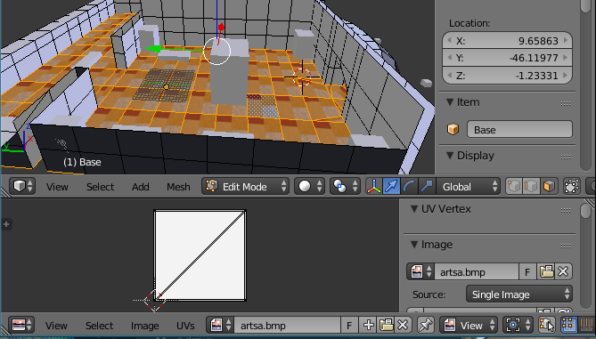
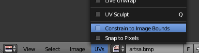
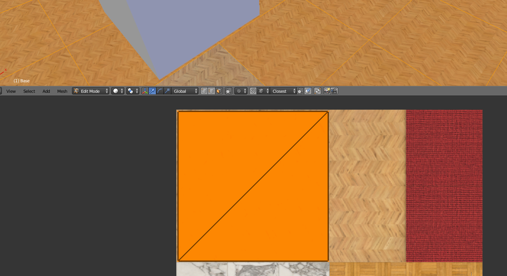
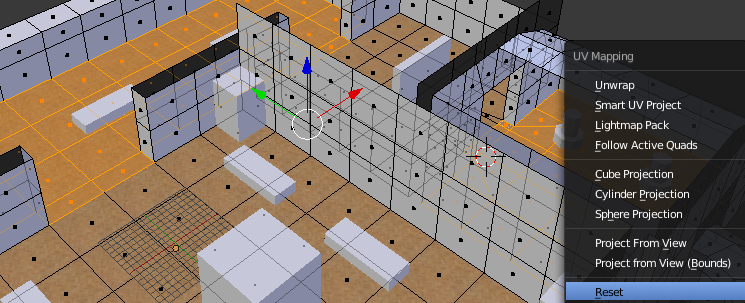
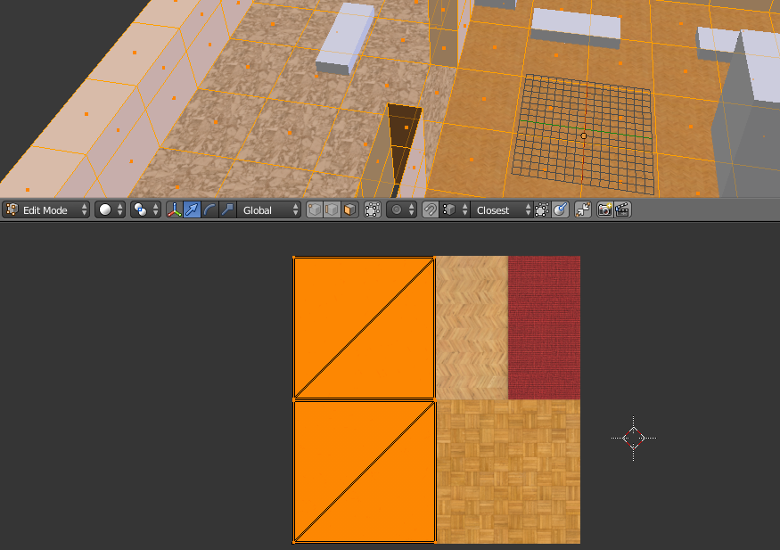
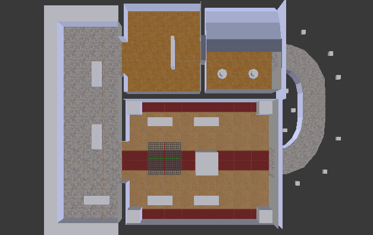

# Mapping Textures in Blender

<!-- MarkdownTOC autolink='true' -->

- [Loading and assigning Textures](#loading-and-assigning-textures)
- [Navigating the UV Image Editor](#navigating-the-uv-image-editor)
- [Manipulating the UV Map](#manipulating-the-uv-map)
	- [Using Reset](#using-reset)
	- [Zip-Snapshot 05](#zip-snapshot-05)
	- [Using Unwrap](#using-unwrap)
	- [Using Project from View](#using-project-from-view)

<!-- /MarkdownTOC -->

You can [watch this part on YouTube](https://youtu.be/Jpoz3U5b1Fw).

The textures you import into Blender have to be the correct format already:
Height and width of each texture has to be a power of two, as mentioned earlier. Make sure that your filenames are right (e.g. tracknamea.bmp, tracknameb.bmp, ...).
Let's import the first bitmap into Blender. In my case it is `artsa.bmp`.

> You need to have _Textured Solid_ shading enabled, if you didn't already activate it in the Edit Mode part.

## Loading and assigning Textures

To apply textures to 3D models for use with Re-Volt you need to *paint them on*. You do not need to create materials for a texture. 

First you need to open the UV/Image Editor:

In the **UV/Image Editor**, load a new texture by clicking on **Open**. Select your bitmap file. If you loaded a bitmap before, you can select it from the dropdown list next to it. Don't open files twice (you'll get filenames with .001 endings and those will not export to Re-Volt.

Select the object you want to map and go into edit mode. Now select one or multiple faces you want to apply the texture to.
> To select all faces that are on one level, select one face of the ground and press **SHIFT G**, then select **co-planar**. It will select the whole floor if it's on one level.

Now you need to map/unwrap the polygons. Move your mouse back to the 3D viewport and press **U** (with the faces selected that you want to unwrap). For now, choose **Reset**. You will see that there are multiple quads (all layed over another) in the UV/Image Editor. You can select them just like things from the 3D viewport. They represent your 3D object in a 2D texture space, so to say. For example, you can select all of them and scale them down, then move them to the part of the texture you'd like them be at.

## Navigating the UV Image Editor
Some basic and advanced tips.

+ Drag the view aroung with the **Middle Mouse Button**
+ Zoom with the **Scroll Wheel**
+ Press **HOME** to reset the zoom level
+ Make sure **your mouse is inside the Image Editor when working with it**
+ When in Edit Mode, you can export the UV map. Select everything with A and then click **UVs -> Export UV Layout**. You can then use it as a base for your textures.

## Manipulating the UV Map

### Using Reset

Before you start mapping, please enable **Constrain to Image Bounds** as it's technically required by Re-Volt. This will make sure that all mapping coordinates stay inside the texture.

Now that we have loaded the texture, it's time to map the faces we assigned the texture to. Just press **A** while your mouse is in the Image Editor. You will see that you can select those 2D faces just like the 3D ones in the view port. In this case, I need to scale them down by half by typing **S 0.5**. Then I just move them to the top left corner of the texture by pressing **G** and using the mouse to move them.

> I also scaled it down a bit again so that there are small margins to the other parts of the texture and the borders of the texture. This is to ensure that no other parts of the texture will bleed through when the game filters/smoothens the textures. 

It's not perfect yet. You might have noticed that this only worked for (almost) perfectly square faces/polygons. I also don't want the entire floor to be wood. First, I'll take care of the other floor types. To do this, I again selected the faces I want to map another floor texture to. (Optional/Possible: Press U and R again and scale it down to the desired size.)

Then, in the Image Editor, press **G** to move the UV of the polygons you selected to another part of the texture. 

> Remember, you can move, rotate and scale the UV as you were able to in the Edit and Object mode. You can also **mirror** by scaling by -1 (e.g. type **S X -1** to mirror horizontally).

The result should look similar to this:

> To view the entire UV map, select the entire object in the 3D view port

**Summarizing my workflow for large areas:**
1. select all similar faces (roughly same shape, supposed to have the same texture)
2. load and apply the texture sheet to them
3. unwrap them using *Reset*
4. select all faces in the UV/Image Editor and move them to the appropriate place on the texture sheet

For more complex objects it would be better to actually *unwrap* (choose something other than Reset) them.

### Zip-Snapshot 05

If you're stuck, here is my current level folder: [**Download Zip File**](track_snapshot05.zip)

### Using Unwrap

Sometimes you'll need to map larger chunks of faces onto one texture region. To do so, select all the faces you'd like to map, press **U** and select _Unwrap_. This will map all selected faces in one go, mostly proportionate. In some cases, you'll have to rotate the mapping and scale it the way you want it. I used a combination of this and _Project from View_ (explained in the next step) to unwrap the walls.

[YouTube: Modeling and Texturing a Tree](https://www.youtube.com/watch?v=6LqJ0KGJNWI)

---

With these techniques, I was able to map the floor and the walls.

### Using Project from View

Sometimes it's really useful to map the geometry's shape as it is in the view port directly to the texture. This works best with polygons that are aligned to the global axes (X, Y, Z). You can align the camera using the numbers on the numblock or by holding down **ALT** while panning the viewport with the **middle mouse button**. Then press **U** and choose **Project from View** (...Bounds will span the mapped part over your whole texture).
Whenever you can't align the view to the faces, you can always use _Unwrap_ instead.

[YouTube: Creating textures for the walls and mapping them with various techniques](https://youtu.be/aTEIB234OUo)

