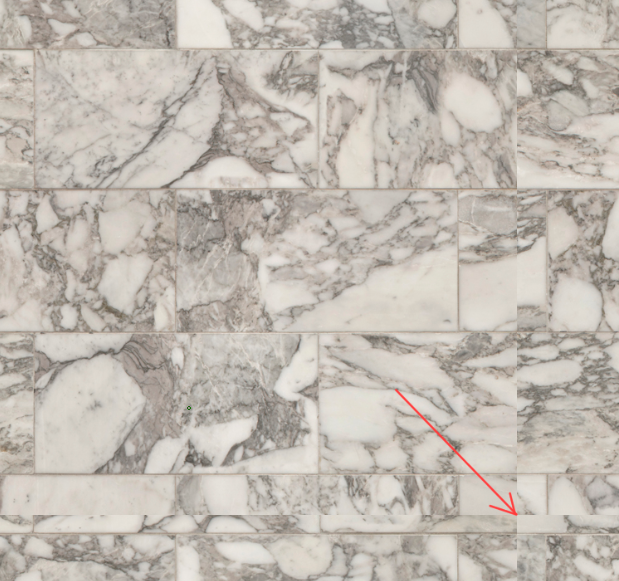
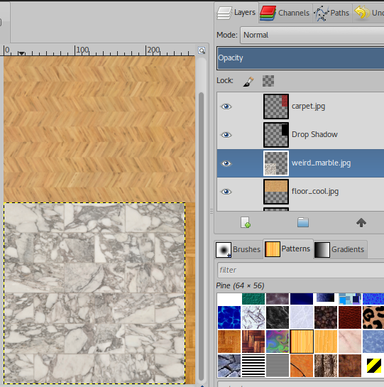
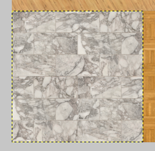

# Creating Textures (Advanced)

> Under Construction
Here I'm planning to explain how to 

* make textures seamless,
* bake textures using Blender
* compose textures with light

## Making Textures Seamless

You might have noticed that some textures do not tile very well. There are seams all over the edges.

Here I selected the layer I want to make seamless:

To make it seamless, go to **Filters -> Map -> Make Seamless**. The result should look like this:

