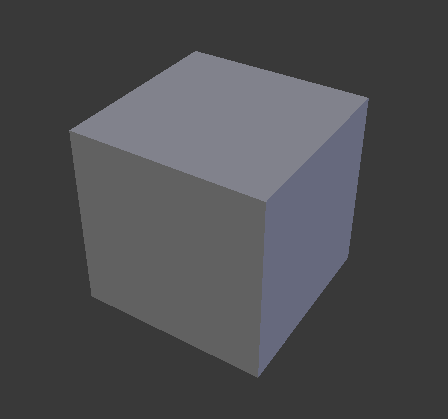
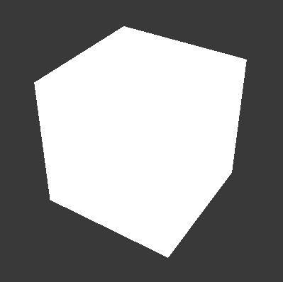
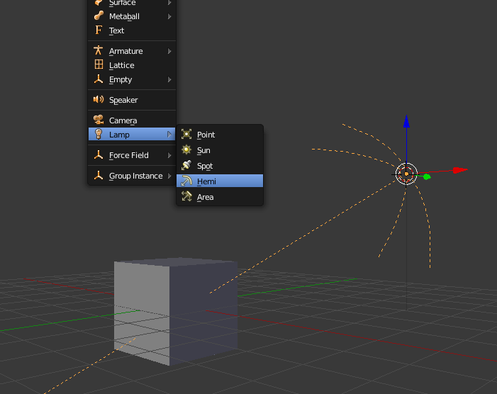
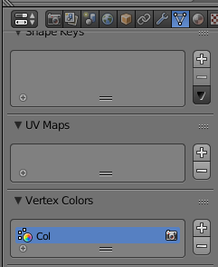
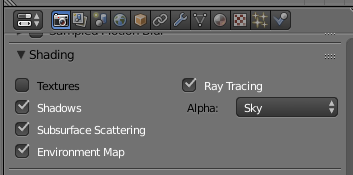
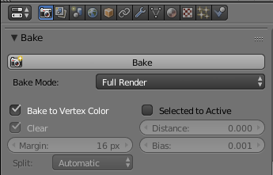
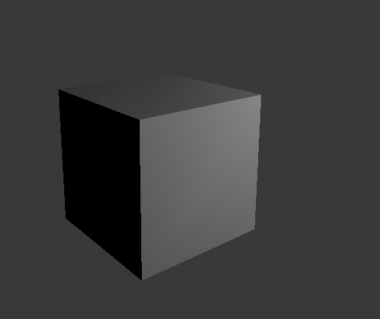

# Vertex Paint

<!-- MarkdownTOC autolink='true' -->

- [Automatic Shading](#automatic-shading)

<!-- /MarkdownTOC -->

In this step, I'm planning to explain how to add lighting to your track as well as sharp shadows using the knife tool.

## Automatic Shading

> An easier one-click function is now included in the Blender add-on. See [**here**](https://re-volt.github.io/re-volt-addon/html/tools-panel/light-and-shadow.html#shade-object) for instructions.

Here I will show you how to automatically bake the lighting from Blender onto the vertex color channels of the objects so your level doesn't look so flat in-game.  
This is how you're seeing your objects in Blender. There is some shading applied to it and you can distinguish some edges. The sides also have different shades.  

Now, if you export it and view it in the game, it will normally end up looking like this (white since there's no texture assigned at the moment):  

Let's add some lights to your track. Press **SHIFT A** and select a light source. Then rotate it as you would do with other objects. In the Properties panel on the right, you'll be able to set brightness and light color. I set it up like this:

You will need to add a _Color Channel_ to the objects you want to shade. To do so, select your object by right clicking and then head over to the _Object Data_ panel and search for the list of **Vertex Colors**. Click on the little plus and a channel will be added.

Before applying the shading to your object, you'll have to adjust some settings in the _Render_ tab of the Properties panel. Turn **Textures off**.

All that's left to do is bake the light onto that channel (you have to do that once per object). Enable **Bake to Vertex Color**, make sure Full Render is set as the Bake Mode and then hit the **Bake** button. To preview, set the 3D viewport to _Texture_ mode.

In texture mode and in-game, your object will now be shaded:

You can change the way things are lighted by adding multiple light sources, setting them up in different directions, with different brightnesses and colors.