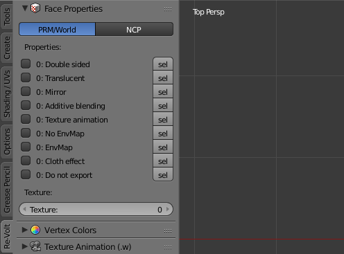
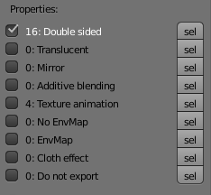

# Polygon Properties

<!-- MarkdownTOC autolink='true' -->

- [User Interface](#user-interface)
- [Property Explanations](#property-explanations)
	- [Double Sided](#double-sided)
	- [Translucent](#translucent)
	- [Mirror](#mirror)
	- [Additive blending](#additive-blending)
	- [Texture Animation](#texture-animation)
	- [No EnvMap](#no-envmap)
	- [EnvMap](#envmap)
	- [Cloth Effect](#cloth-effect)
	- [Do not export](#do-not-export)

<!-- /MarkdownTOC -->

Each polygon (face) can have multiple properties. In Edit Mode, the panel for face properties can be found in the Re-Volt tab of the tools panel on the left side of the 3D view.

## User Interface

While a face is selected, the checkboxes and the numbers next to them represent its current state.  
If the checkbox is checked, all selected faces have this property enabled.  
If the checkbox is not checked but the number next to it is _not_ 0, some of the selected faces have the property enabled.

Here's an example: All of the 16 selected faces are double-sided but only 4 have texture animation enabled:

To select/deselect all faces with a property, click on the **sel** botton next to the propery in question.

## Property Explanations

### Double Sided
The polygon is visible from both sides in-game.

### Translucent
When enabled, the polygon will be rendered transparent according to the Alpha vertex color channel _or_ the transparency of the texture (e.g. PNG or 32bit Bitmap).

### Mirror
todo

### Additive blending
Renders the polygon with additive blending: Colors of the polygon will be added to the underlying color values.

### Texture Animation
Enables texture animation for the polygon.  
World files have 10 slots for texture animations, the same amount as the number of texture pages per track.  
The texture animation slot is determined by the texture set on the polygon:  
If texturea.bmp is mapped to the polygon, slot 0 will be used,  
if texturec.bmp is mapped to the polygon, slot 2 will be used.

### No EnvMap
Only used in PRM files. PRMs have env enabled by default. Setting this will disable it.

### EnvMap
Mostly used in World files. World files don't have env enabled by default. Setting this will enable it.  
As for PRMs, the pickup model (models/pickup.m) uses this to determine the polygons that generate sparks.

### Cloth Effect
Enables the cloth effect, used on the Mystery car.

### Do not export
A custom flag not used by Re-Volt. Faces with this property enabled won't be exported.