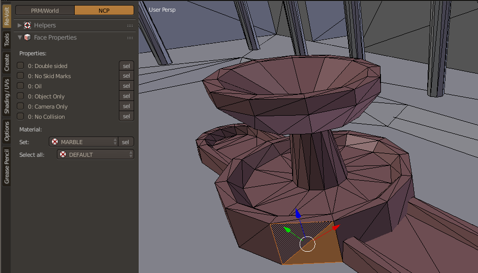

# Collision

<!-- MarkdownTOC autolink='true' -->

- [Collision Mesh](#collision-mesh)
- [Properties and Materials](#properties-and-materials)

<!-- /MarkdownTOC -->

The NCP file contains all collision information of your track. Without it you would not be able to drive on it.  
It also contains information about the surface itself: Material (dirt, ice, etc.), whether it collides with the camera or not and some other properties.

## Collision Mesh

It's generally advised to make a separate mesh for your track's collision. This allows you to be more efficient with the polygon count (since you don't have to care about texture tiling).  
Most stock tracks have an NCP file that is a lot simpler than the .w file (the one that contains all geometry and texture information).

> Take nhood1 as an example. Import the .w file and then the .ncp file. You can see that the road of the .w file is divided into smaller tiles while the NCP file has longer polygons for the straight parts of the road.

## Properties and Materials

Switch to edit mode and click on the NCP tab in the Re-Volt toolbar.

To apply properties and materials, select the polygons in question and set the properties by clicking on the checkboxes and selecting a material from the list. You will see that the polygons change color depending on the material you chose. 

> In order to see the color preview, make sure Blender is set to solid mode. If textures are assigned to your mesh, you might have a harder time seeing the colors (that's why it's recommended to have a separate clean mesh for your track collision).

> You can hover any of these properties in Blender to see an explanation of what they do.
