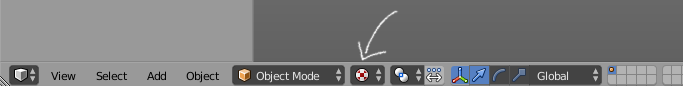
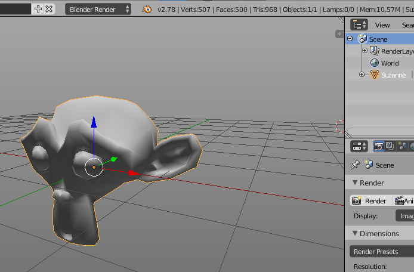
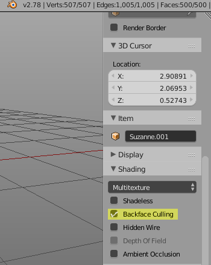
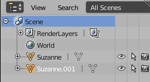
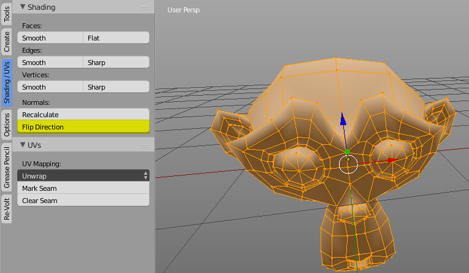
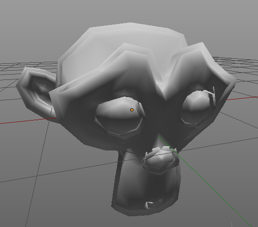
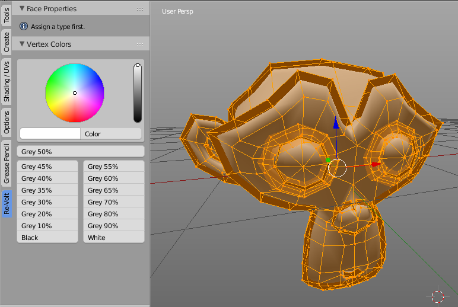

# Special Effects

<!-- MarkdownTOC autolink='true' -->

- [Cartoon Style](#cartoon-style)

<!-- /MarkdownTOC -->

If you want to give your track (or even car) a special look, you can try out one of these things:

## Cartoon Style

Cartoons often have outlines around characters and objects. In modern games, this could be achieved with a shader. However, Re-Volt doesn't support such fancy technology. There _is_ a way to get your cartoon fixings despite the games ancient technology.

> Please excuse the different Blender theme I'm using, it's much easier to see things with a brighter background!
<cite>Marv</cite>

Alright, first off, here's what we're aiming for:

Before we get started, you might want to set your view port to **Texture Mode** in order to see vertex colors:

So, you're a bit bored by the appearance of your object, right? Perhaps you're a bit lazy to work out the textures and all you have right now is a shaded monkey.  

One thing to note is that results with more complex models may vary, perhaps even require manual cleanup. In this case, it works out alright if you're not a perfectionist (which I know you are!).

To even see what's going on, we need to adjust a setting in the 3D view. Do you remember the panel on the right? You can toggle it by pressing **N**. Press it a few times to see which panel I'm talking about.  
Now scroll down a bit and make sure **Backface Culling** is **enabled**.  

The first step is to duplicate your object. I'm going to demonstrate this in **Object Mode** since it's easier to work with.  
To duplicate the object, I press **SHIFT D**. You will then have another instance of the object stuck to your cursor. We don't want to move it anywhere else, so hit **ESC** or **RMB**.  
If you look at your outliner in the top right, you'll see two of your objects:

Now let's change into **Edit Mode**. Make sure everything is selected by pressing **A**. The first thing we'll do is to **flip the normals**. To do that, either hit **SPACE** and type **Flip Normals** or click this button:

You won't see any difference just yet.  
Now let's get to the juicy part. Make sure everything is still selected! Press **ALT S** (this tool is called Shrink Flatten) and move your mouse around. If you're unsure, enter something like **-0.1** on the keyboard and press **ENTER** or **LMB**. You will already see that something like an outline will form:

  

 Now it is time to assign a color to the outline. Head on over to the Re-Volt tool tab and locate the Vertex Color Panel. You might be prompted to create a vertex color layer. Do so.  
 When your object has a vertex color layer, you will see the buttons for setting colors. Either pick a color or a shade and press a button (I chose black because I'm boring). You will then see that the outline changes its color:  
 
 
 Enter Object mode again and bewonder your final result. Perhaps go back and change the color or use ALT S again to change the thickness. Yes, I know, there are some rough edges but you have to understand that the game is from 1999, alright?
 
 
 
 Now, feel free to merge the two objects by selecting them and pressing **CTRL J**. You have to do this for exporting cars (.prm), but not when you're working on a track (.w).