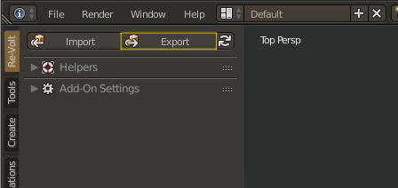

# Exporting

<!-- MarkdownTOC autolink='true' -->

- [Export](#export)
- [World \(.w\)](#world-w)
- [Collision \(.ncp\)](#collision-ncp)

<!-- /MarkdownTOC -->

Your track can now be exported from Blender to the Re-Volt file formats. For now, you will have to focus on the following two:

**World (.w)**: Contains all 3D data  
**Collision (.ncp)**: Contains data for collisions

## Export

The Re-Volt add-on supports various formats. To export a file to any format, proceed as follows:  
Make sure you're in object mode. Click on the _Export_ button in the left toolbar. Alternatively, use File -> Export -> Re-Volt.  
The file type will be determined by the file name ending (.e.g. `.w`).

## World (.w)

Export your file as `trackname.w` into your level folder, where `trackname` is the name of your track. It needs to match the folder name.

## Collision (.ncp)

Export your file as `trackname.ncp` into your level folder, where `trackname` is the name of your track. It needs to match the folder name.

> Exporting to NCP is a heavy task, it might take up to 5 minutes.

