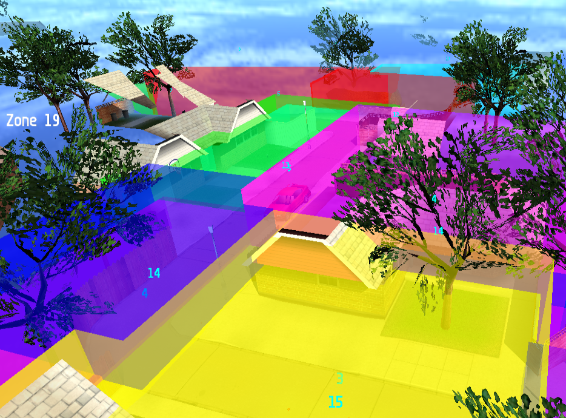

# Track Zones

<!-- MarkdownTOC autolink='true' -->

- [Keymap](#keymap)
- [What are Track Zones?](#what-are-track-zones)
- [Track Zones in Races](#track-zones-in-races)
- [Track Zones in MakeItGood](#track-zones-in-makeitgood)
- [Controls](#controls)

<!-- /MarkdownTOC -->

## Keymap

## What are Track Zones?

Just like the name hints, track zones are actually zones (boxes) that define which parts of tracks are race-able as well as the racing order.

For this, each track zone has a unique ID which defines the order. Therefore Track zone 0 is the start zone (where all the cars should start from and inside) up to the final track zone whose ID should be _number_of_trackzones – 1_.

## Track Zones in Races
The track zones are actually ‘invisible’ inside a normal race, however, they’re actually present and they define the right orientation and position of the player as well as other cars with the help of POS nodes.

## Track Zones in MakeItGood

Just like any other MakeItGood mode, Track zones can be accessed through ‘Edit Mode’ accessible using -dev mode or using MAKEITGOOD as the player name.

Track zone edit mode is one of the easiest mode, in fact, there are not many keys you have to use.

## Controls

+ **Insert**: Inserts a new track zone.
+ **Numpad +** and **–** : Modify the ID of current track zone.
+ Moving mouse cursor to a track zone and clicking on **Enter**: Select a track zone
+ **Space**: toggle the selected track zone’s one of the 6 surfaces (top, right, bottom, left, front, back) for later modification
+ **Numpad** `*`  and **/** : Extend or shrink the currently selected surface
+ **Numpad** `*`  and **/** with CTRL pressed (down) : Extend or Shrink faster
+ **Numpad** `*` and **/** with SHIFT pressed (down) : Extend or Shrink all surfaces
+ **Numpad** `*` and **/** with **SHIFT** and **CTRL** pressed (down) : Extend or Shrink all surfaces faster.
+ the key labeled **2** (above q,w,e,r) : Toggle seeing other track zones

As well as the classic edit mode controls:

+ **Numpad 1, 2, 3**: 90° rotation along the chosen coordination system
+ **Numpad 0**: restore orientation
+ **Tab**: toggle the chosen coordination   system (camera/world)
+ **Alt**: Toggle the axis system (X-Y alone, X-Z alone, X alone etc…)
+ **F4**: Entering edit mode
+ **CTRL+F4**: Saving current work

> Tutorial written by Kallel
