# AI Nodes

> To make the CPU cars drive around in a track you will need AI nodes. Without AI nodes you can’t have a proper race against the AI.

<!-- MarkdownTOC autolink='true' -->

- [Keymap](#keymap)
- [What is AI?](#what-is-ai)
- [What exactly are AI nodes?](#what-exactly-are-ai-nodes)
- [1. How to enter edit mode?](#1-how-to-enter-edit-mode)
- [2. Making your track ready for AI nodes.](#2-making-your-track-ready-for-ai-nodes)
- [3. Inserting the first nodes](#3-inserting-the-first-nodes)
- [4. Connecting the nodes](#4-connecting-the-nodes)
- [5. Reconfiguring the AI Path](#5-reconfiguring-the-ai-path)
	- [The Purple Line](#the-purple-line)
		- [Tricks for using the purple line](#tricks-for-using-the-purple-line)
- [6. AI Nodes Properties](#6-ai-nodes-properties)
- [A. Racing Line](#a-racing-line)
- [B. Pickup Route](#b-pickup-route)
- [C. Stairs](#c-stairs)
- [D. Bumpy](#d-bumpy)
- [E. 25 mph Slow Down](#e-25-mph-slow-down)
- [F. Soft Suspension](#f-soft-suspension)
- [G. Jump Wall](#g-jump-wall)
- [H. Title Screen Slow down](#h-title-screen-slow-down)
- [I. Turbo Line](#i-turbo-line)
- [J. Long Pickup Route](#j-long-pickup-route)
- [K. Short Cut](#k-short-cut)
- [L. Long Cut](#l-long-cut)
- [M. Barrel Block](#m-barrel-block)
- [N. Off Throttle/Petrol Throttle](#n-off-throttlepetrol-throttle)
- [O. Wilderness](#o-wilderness)
- [P. 15/20/30 MPH Slowdowns](#p-152030-mph-slowdowns)
- [Extra Things](#extra-things)
- [Tips and Tricks](#tips-and-tricks)
	- [String multiple node properties together to get the best AI.](#string-multiple-node-properties-together-to-get-the-best-ai)
	- [Keep the line level and smooth.](#keep-the-line-level-and-smooth)
	- [Create an AI line out of a ghost path](#create-an-ai-line-out-of-a-ghost-path)

<!-- /MarkdownTOC -->

## Keymap

## What is AI?

AI is short for Artificial Intelligence, which means that the computer cars have their own “fake” intelligence. But still, the cars don’t know where to go, and how fast they should go, and when to brake. This is when AI nodes comes in handy.
The cars do know how to read the AI node path, which is a part of their intelligence.

## What exactly are AI nodes?

AI nodes are nodes in a track, which you can connect to make a complete path. The nodes tell the cars how to drive in that part of the track. With AI nodes you have the exact control over your AI cars, telling them what way to go, let the cars maintain a certain speed, give the cars actions, like: taking the pickup route, using the battery, drive careful under stairs and many more things.

## 1. How to enter edit mode?
There are two options
+ v1.2 of Re-volt or RVGL has a DEV-mode. You can unlock DEV-mode by pressing the following arrows in the start menu: up, right, down, left, up, left, down, right. Now you have unlocked the edit mode.
+ You can unlock edit mode by typing MAKEITGOOD in the name wheel. The edit mode is less advanced than the DEV-mode, because DEV-mode unlocks all the cars while being in the mode, unlock all the tracks, give you a few options while editing like pressing F8 for making a screenshot, F9 for statistics and much more. Thus I recommend using the DEV-mode. For this you have to download version 1.2, which you can find on the following website: [http://rv12.revoltzone.net.](http://rv12.revoltzone.net).

After unlocking edit mode or DEV mode you go to the race selection screen. Go down the menu and there is a new mode called Edit mode. If you choose this mode you can use the left and right arrow keys to navigate between modes, for example: POS nodes, Objects, Track zones, Triggers, Lights, AI nodes and much more. But the thing we need are AI nodes. For making the the first AI nodes you might want to select Edit mode instead of Single race, so let’s do that.

Why select Edit mode instead of Single race?

In single race you have AI cars. Those AI cars will follow your node path. If your node path is not finished, the game will crash! By choosing Edit mode you can safely create the AI path, before letting the AI cars drive on it, as edit mode is quite the same as the Practice mode, just with a timer. (basically single race with one car.)

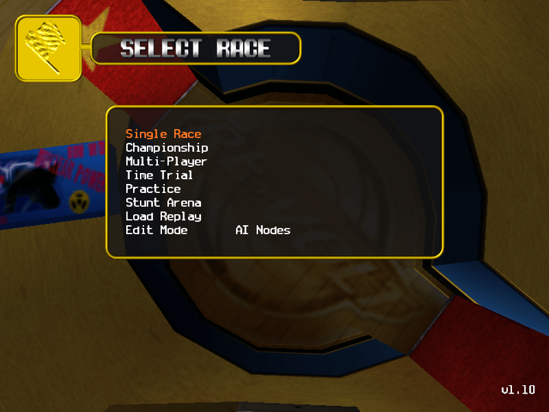
>The AI node edit mode in the race selection menu.

If you have done this, we can advance to the next step, which is making your track ready for AI nodes!

## 2. Making your track ready for AI nodes.
Before creating AI nodes I suggest to create POS nodes and Track zones first. Also you have to put a definite starting position in your track. This to make things easier for you.

## 3. Inserting the first nodes
Go to the track you want to edit. To edit you have to press the F4 button, to enter Edit Mode. Your HUD will disappear and a mouse arrow will appear. This mouse arrow is your best friend, with the arrow you can select nodes, navigate through the track (with right mouse button), do a lot of other things.

Important to remember: the Left side is the Green bubble, and in the Right side, put the Red bubble.

Press Insert, to insert your first node at the left side of the track. This will be the place where the green node spawns. Hold your left mouse button and move the red node to the right side of the track.

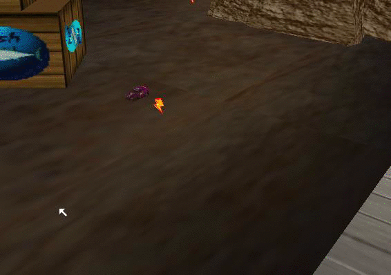

>Placing the first node in AI nodes Edit Mode.

So, you have placed your first node and two bubbles! Now repeat this throughout the whole track. There are a few tricks in making AI nodes.

1. At least place a pair of nodes every 3 car lengths.
2. Turns will need more nodes, for the better AI intelligence.
3. More nodes means better intelligence, the AI will get more information -> can cope better with AI problems, like getting stuck, crashing into walls etc.

>Nodes for a normal turn.

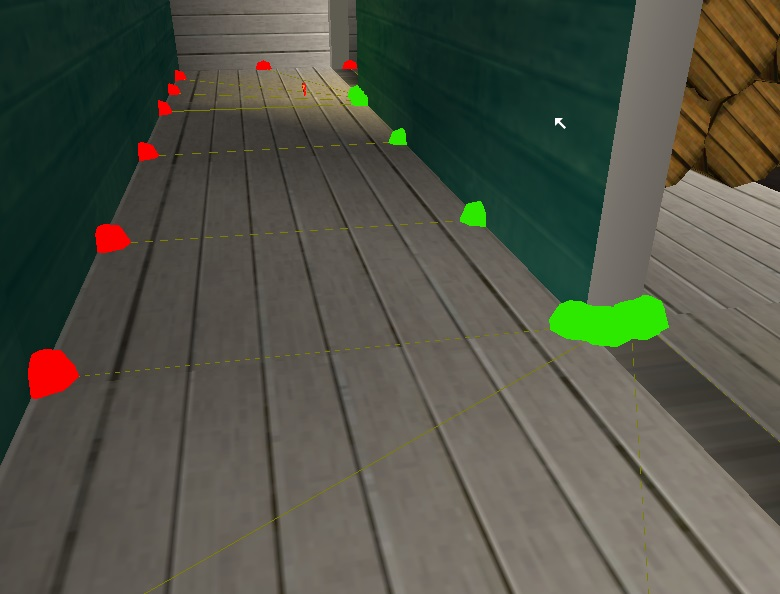

>Nodes for a sharp 90 degree turn.

As you see in the two pictures above, you will see both ways to place nodes. In a normal turn you don’t have to put as much as in a sharp turn. It is important to have more nodes, as the AI won’t steer well while being in both nodes, it needs new instructions. If there are a lot of nodes, you will see the AI steering much smoother!

If you placed all the nodes, then it should look like this:

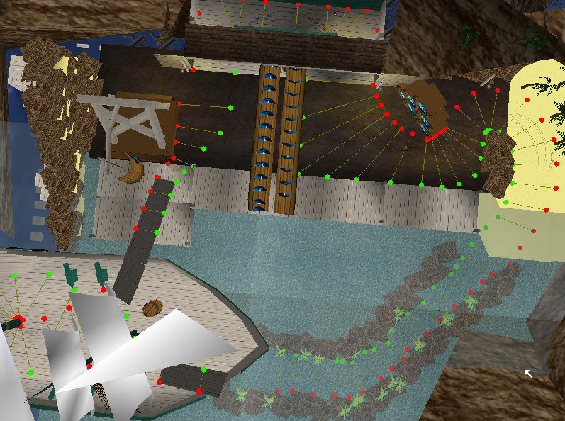

**Note:** Please notice that they are NOT connected and that there is no middle line yet.

As you can notice the ‘bubbles’ are blinking. This is because they are not connected yet. In the next step you will learn how to connect nodes.

## 4. Connecting the nodes

If you did everything correct, and followed correct the last steps, you will be able to connect the AI Nodes that you inserted.

Put your mouse over the first start node. Press enter to select the node. Hover your mouse over the second node, and press Space. Now hover the mouse over the next node, and press Space again! Now you have connected the first three nodes. By doing so this way, it will look like this:
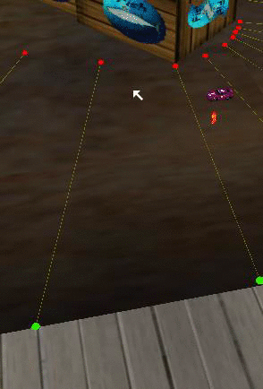
>Connecting the first two AI nodes!

Connecting AI nodes has never been so easy!

Continue until you connect all lines correctly.

> **Note:** Check your nodes, so they have green bubbles left, and red bubbles right! This is very important, if this is not the cause your track will crash most likely. BUT! Why don’t the nodes stop blinking? Don’t worry.

You have to save! To save you have to press ‘Left Ctrl + F4‘.After this you will see a pop-up window, telling you “trackname.fan” is saved! Now check the AI Nodes, and you’ll see that they’re not blinking anymore. If they are still blinking then you did something wrong. This happens if you didn’t connect them properly.

After this, go back to the main menu. Now start a single Race in your track, and see those AI cars driving, following your nodes? Good job.

## 5. Reconfiguring the AI Path

Now you’re going to learn how to reconfigure the AI path.

I suppose your AI nodes kind of look like this after connecting:

>AI nodes after connecting them!

What is wrong? Well, nothing is wrong! Just the AI path is exactly in the middle of all the nodes. Maybe it could work on some tracks, but not on ones with 90 degree sharp turns, chicanes, etc. To fix this, we need to reconfigure the AI path.

How to do this? We have to use the numpad / and * keys first, to edit the white path. Try it for yourself; Select the first node, press *, and the white line will move to right. Same goes for going left with the / key.

> **Note:** This is only possible with a numpad!

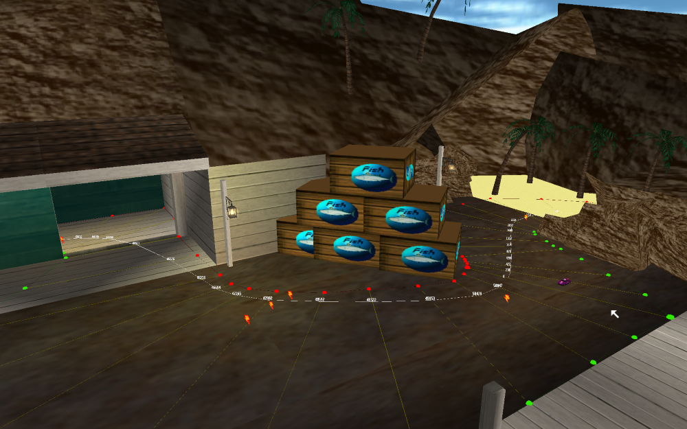
>AI Nodes after reconfiguring them.

Okay, look at that white line now! Looks much smoother, isn’t it?

There are a few tricks. While editing the white line you have to think about the smoothness of the AI, and let them brake as less as possible, as pretty many cars in Re-Volt doesn’t have the best acceleration.

In the real RC world there is a trick for taking turns, in a real track.

|  | 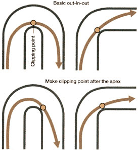 |
|------------------------|-------------------------|
| This is the standard trick of taking a corner in a RC car race. | Multiple ways of taking a corner. |

Those pictures are from a real RC manufacturer (tamiya.com), take these pictures in consideration for creating the perfect AI.

### The Purple Line

While editing nodes you see a purple line. What the hell is that???

The purple line is the overtaking line, for your AI nodes. If there is a faster car, they can take the overtaking line so they can overtake the slower car, when the slower car gets lapped, or making a collision with your or another car.

After creating your white line, I suggest select the first node, press Shift+Space to delete the purple line. After that you can edit the overtaking line with the numpad keys 8 and 9.

#### Tricks for using the purple line

With purple line you can do a few nice tricks, see here:

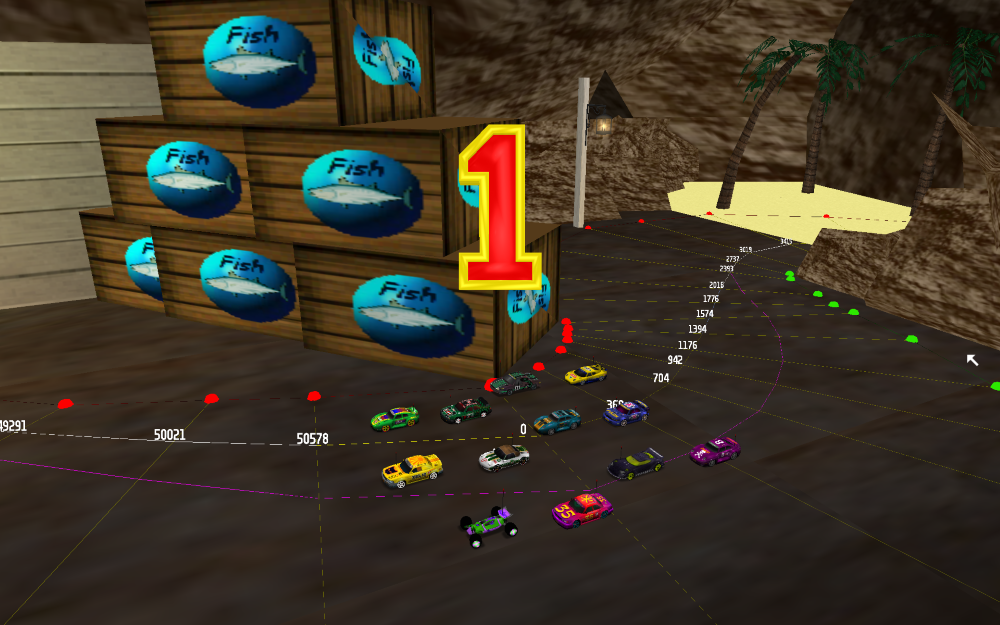
> The purple line trick, for the start – the bottom four cars will follow the purple line in this case, thus there will be less start crashes!

The second trick – you can use the purple line to let cars avoid the oil puddles that are commonly placed – a lot of crashes happen there which means you can “overtake” them, and the oil puddle!

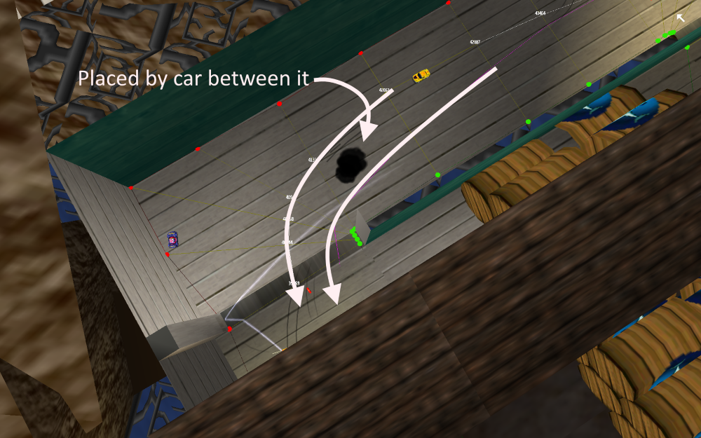
> Okay, a car placed a oil puddle between two lines. Imagine if there was one line, then the chance for driving over an oil puddle is doubled. The purple line prevented it a few times.

## 6. AI Nodes Properties

Now that you have the base idea down, it’s time to learn how to give properties to the AI Nodes. To change the properties for the racing line press ‘Numpad Enter‘ and you’ll see that the line changes its color, depends of the property. If you want to move the properties the other way, press ‘Left Shift + Numpad Enter‘ This is one of the most important steps when you create AI for your track.

## A. Racing Line

It is the first property you get. If you take a look, after you connected the nodes, you’ll see a white line in the middle. That is called Racing Line. It means, that it doesn’t really have a property. It leaves the AI Cars to drive at their max speed. That’s why in the beginning of the curves you should never use this. This is recommended for the zones where you have enough space to drive faster, you and the AI, like the long straights in Toys in the Hood 1.

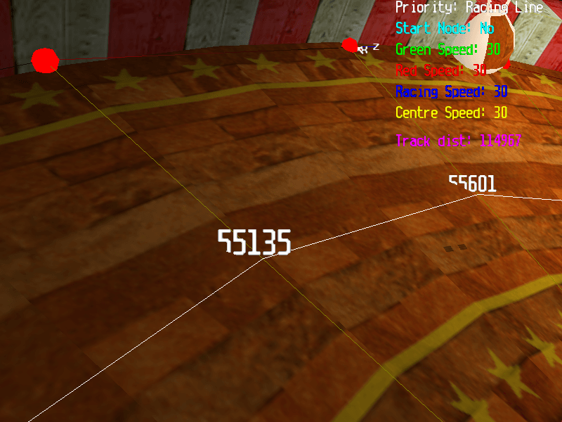
> The white Race Line property – cars will drive at their maximum speed

## B. Pickup Route

This one is always used when you have a track with splitways. The AI takes only one route out of two, then choose for the one they don’t take, the property as Pickup Route. The AI cars that don’t have any weapon ready for use, will take that route to get a weapon from the pickups.

If the car has a weapon ready it will ignore that route. As you can notice the line is now light blue. That means that it’s not a simple white racing line anymore, you only need to assign it one or two times, not for the whole splitway.

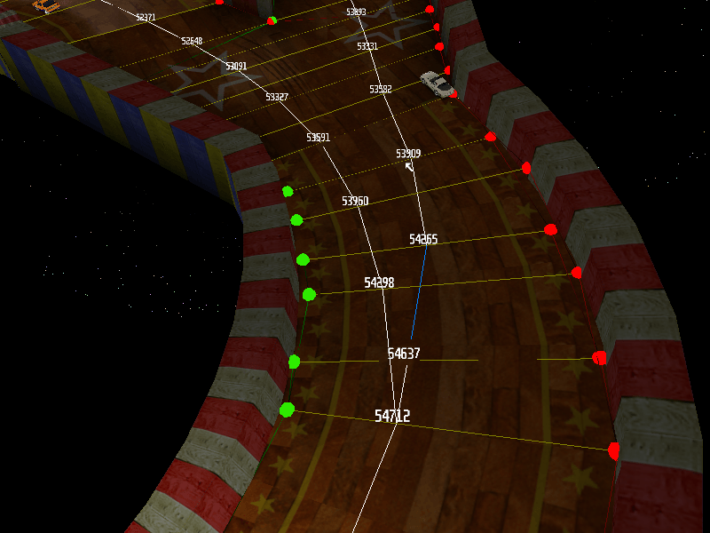

Can you see that car that used the route with the Pickup? Can you also notice the blue line? This means that the car doesn’t have any weapon ready.

## C. Stairs

This is one of the least used AI properties. It is always used when the AI Cars drive on stairs, the AI will stay carefully on their wheels and maintian balance. The line of this property is grey.

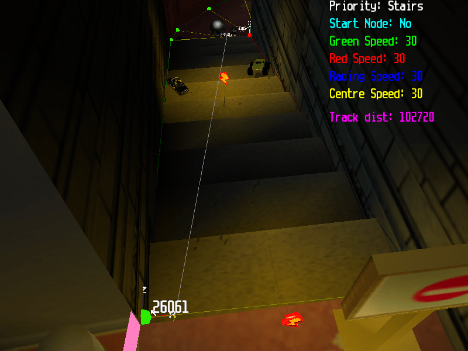

## D. Bumpy
The big roaring cars, like Phat Slug, Panga, Bertha Ballistics and Mouse takes that line. It is used for tracks with normal and offroad roads. When you make AI Nodes for the offroad part, choose, like on Pickup Route, Bumpy. I don’t really think it works, but it worked on some tracks. It is like Soft Suspension – another AI Nodes property that we’ll learn soon. The line of this property is a dark brown. Aeon, a good AI Nodes editor says that the Bumpy is:
> (Aeon)
>> Bumpy – or whatever it was called – is a route that is more likely to be chosen by cars which have a high Suspension AI setting.

And he was right!

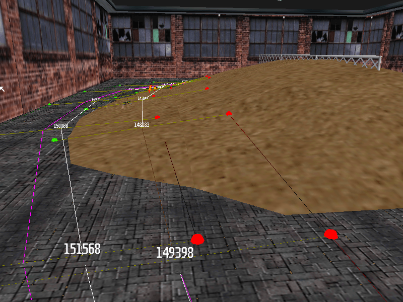

So, if you have offroad tracks, try to use this property to let the car take a good shortcut.

## E. 25 mph Slow Down
It does what it says. It slows down the AI car to 25 mph. If the car drives faster than this, it will slow it down. It is a very good one. You’ll need also Petrol Throttle or Off Throttle… I’ll tell you soon why. The line of this property is yellow.

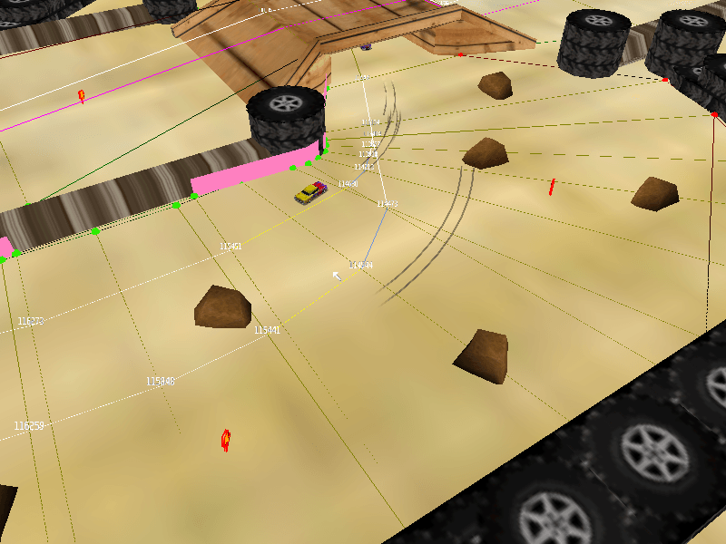

Do you see the yellow lines? That is the 25 mph slow down property. See also the car? It drives now at 25 mph because it is driving through that node.

## F. Soft Suspension
It does again what it says. It is used by the AI Cars that have soft suspension. Here are the stock ones that uses it: Phat Slug, Mouse, Bertha Ballistics, Rotor & Panga.
It is represented by a light pink line. It can be used mostly on track with splits or shortcuts.Let me show you a picture with it and how it works.

Can you see that small car? That one is a custom one that has soft suspension. That’s why it chose that line. Also the light brown line is the Soft Suspension. So, now we can advance to the next step!

## G. Jump Wall

It is used to “skip” sections in the track, for example in case you have a track with a long jump and a bottomless pit, weak cars most likely won’t make that jump.
If you use nodes with that property there and your car crashes in that section, it will be teleported to the next “non-Jump Wall” node (thus helping the cars over the jump).

However even though this property can be extremely helpful in tracks that have such jumps, it should also be used with care as it could be exploited by players in certain situations where the crash could end up being beneficial instead of causing you to loose time (that’s probably why its not used that much).
But as long as the nodes are placed properly and the track has been tested well enough, this shouldn’t be an issue.

## H. Title Screen Slow down

The name explains it all, it was used in the intro, so the AI cars would drive very slow.

It slows down the car. It slows most of all properties, it slows a car to 5 mph. It isn’t used in any of the stock tracks and not too much at customs. It’s useful for the tracks with small racing line, where the AI crashes in a lot of things.

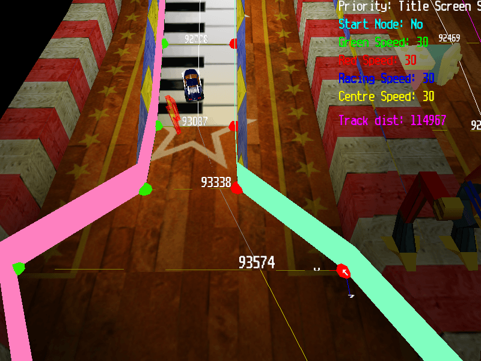

Do you see the car? It’s going very slow at about 5 mph because the racing line is very small, that’s why there are also AI Nodes walls (we’ll learn soon about it).If you understood what it is, let’s go on!

## I. Turbo Line
This one if for telling the AI Cars that it’s a good place for using battery. If the AI car has the battery as the next ready weapon and it drives over a node with this property it’ll use the battery. A tip: don’t place this property along the road ahead. Only at the beginning. If not, it could use the battery only when it finished going through the AI and will be a problem, because a battery-driven AI car is hard to tame with the normal nodes. It is represented by a orangish-red line to suit its action.

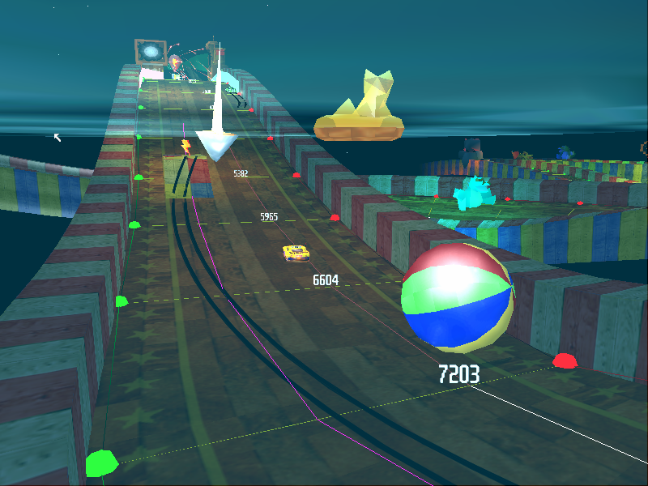

Do you see Cougar that uses the battery? Well, this is because it drives over the AI Nodes with Turbo Line property. Also, do you see that it’s low ahead road? No curves? So it has to be. Find the best place for battery use, and use the property there. Every track needs one.If you have questions, I hope you know what you should do, just ask here! And now let’s advance!

## J. Long Pickup Route
Like ‘Pickup Route’ this is used to tell the AI Car where to drive to get a pickup if it hasn’t one. It doesn’t work every time on all tracks, but sometimes you can find workable one. The CTR Palm Marsh track used a lot of this. There are 2 routes. One shorter and one longer. On the shorter is no pickup, and on the longer is. So, when you make AI for the longer route, use this property to tell the AI car that there’s a pickup. If not, the AI will ignore that route. The cars that have a weapon already, will ignore that route. The color for this line is dark red.

Do you see the car that uses that line? And it’s also a pickup there that the car just picked up. Also, please notice that that route is longer that the other. That’s why it is called ‘Long Pickup Route’.

## K. Short Cut
It tells the car when there’s a shorter way. If you have a track with two routes, where ever you put that property, the car will follow it. Even if you put the Short Cut for the longer route, the AI will drive only on that route, even if it’s longer. The AI cars sometimes take this route for a short cut. Pretty self explanatory. If the car is close to the node it will take that line over the default racing line. Here’s a picture so you can better understand what I mean.

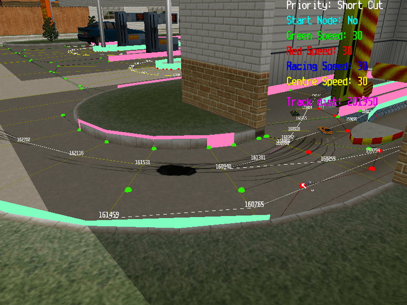

Do you see the cars and the Skid Marks? That means that all the AI cars take that route, even if, how it seems, it’s not the shortest. So, if you want the AI to follow only one route, use this property with the pink line named Short Cut. Let’s skip now to the next property, right? wink.gif

## L. Long Cut
The AI cars sometimes take this route if they accidentally drive into it. This may happen because of oil, getting shoved, or just a simple loss of control.

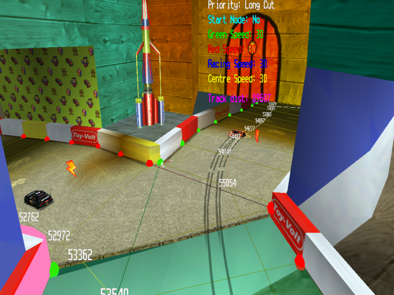

As you can see in the pic above, the AI car on the right lost control and swerved into the Long Cut node. It will follow that until it rejoins with the Racing Line. Moving on.

## M. Barrel Block
This property is unknown, and I could not find anywhere in the stock tracks where it is used.

## N. Off Throttle/Petrol Throttle
It’s very important! Most of the experienced AI users place these properties before using the slow down properties. It doesn’t let the AI cars to get out of control making an 180 turn, losing time. Let me show you a picture to see where to place it…

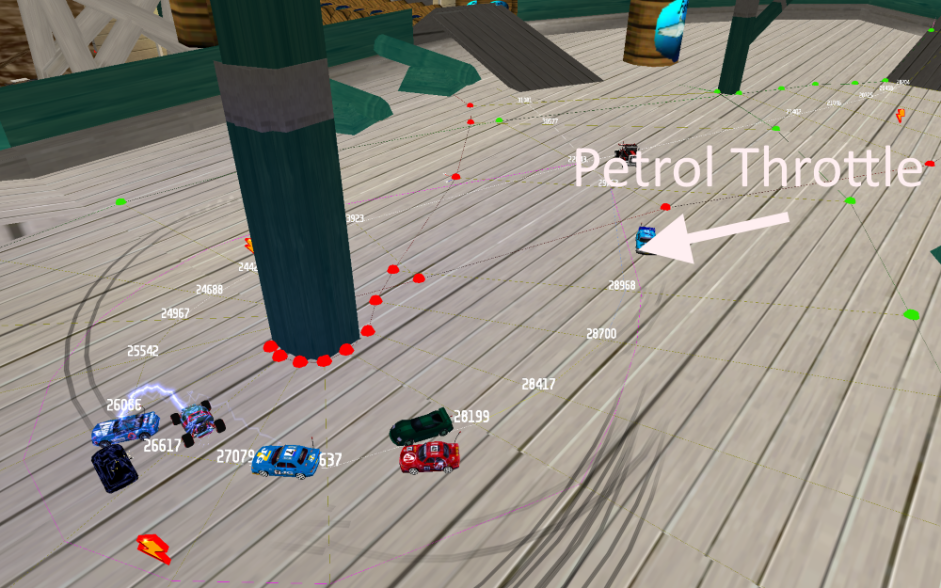

The image shows an Petrol Throttle. The Petrol Throttle makes the car repeatedly go off throttle and then back on quickly. The car goes go, off, go, off etc…
Depends only of you which one you’d like to use.

## O. Wilderness
Not much is known on this property. Urnemanden however has developed a fitting theory that might be true. He says:
> (Urnemanden)
>> I think that the wilderness property was made for the AI to have a backup-line just in case that it came off-road. These backup lines could help the AI avoid all the obstacles on its way back to the racing line, and help it save important time and get further in the race. Of course you just have to set up these backup-lines the most important places.
Urnemanden’s theory is very possible and I think it’s correct.He crashed off the normal Racing Line nodes and ended up on the Wilderness nodes.

## P. 15/20/30 MPH Slowdowns
>> They do exactly what the 25 MPH Slowdown does, they slow the car to the desired speed. By using a good combination of them, you can let the car not slide in turns, like for example use a 30 mph property first, then slow down to 20, then to 15 if it’s a sharp turn.

## Extra Things
What about the reversed track AI nodes? There is a simple, yet good trick for this. Press Shift+R and Shift+T to reverse your nodes.
Same goes for POS nodes, track zones have to be done manually.

## Tips and Tricks
### String multiple node properties together to get the best AI.

Making decent AI involves simply moving the racing line and making slowdowns. Making great AI involves combining almost every type of node.Use the throttle properties!
Sure slowdowns are important too, but if you really want to make good AI you have to use everything. Sometimes slowdowns aren’t the best node for the job. If you have an AI line that has a sharp narrow turn in it, maybe you don’t have enough space to slow the car down, and if you have them suddenly slam the brakes then you might have them crashing into each other. A better alternative would be if you set a Petrol Throttle section a while before the corner, thus slowing the car down more effectively than the wall.

### Keep the line level and smooth.

This may sound stupid, however please keep the line on the ground and not in the sky. How can you edit and perfect your AI when the nodes are floating?
Also, you should try and keep you line as smooth as possible. You wouldn’t want a car to turn right, and then swerve left randomly. That would just make the AI horrendous.

### Create an AI line out of a ghost path

For this one you have to be in the Time trial mode. You need to place the nodes first, but no need to optimize the racing line.

What does this exactly do? Race the best lap you could, preferably without shortcuts, with Toyeca or another car.

Use the key combination ‘6’ + ‘Left Shift’ for applying the ghost path to the racing line, extremely useful if you didn’t work on a racing line yet (the resulting line might require some fine tuning for the AI).

 

>> Thanks to Kenny for the explanation of Jump Wall nodes and for the constructive criticism about this tutorial.
