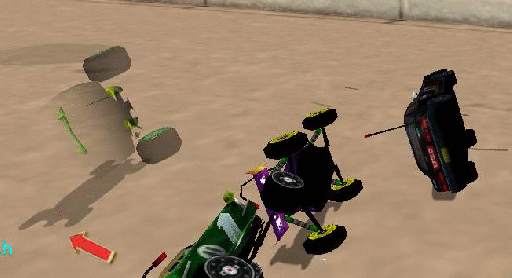

# Force Fields

<!-- MarkdownTOC autolink='true' -->

- [LINEAR \(red\):](#linear-red)
- [ORIENTATION \(green\):](#orientation-green)
- [VELOCITY \(blue\):](#velocity-blue)
- [SPHERICAL \(yellow\):](#spherical-yellow)
- [WIND \(no color\):](#wind-no-color)

<!-- /MarkdownTOC -->

In track making the farce field can be used to add to the theme of a track. Acclaim tracks using farce fields include: Ghost Town 1 and 2, Toytanic 1 and 2 and Toys in the Hood 2.

When in the racing environment hit F4 to enter edit mode and then press insert to begin inserting farce fields. RV will automatically select the Linear farce type. Place the mouse over a field name and press enter to select an already present field. When finished adding your fields remember to hit CRTL+F4 to save your changes.

NOTE: All fields (except spherical) have a white line in the center of the field. This line tells RV which direction to push in. I suggest editing the field’s size and placement in camera axis mode and editing the rotation and direction line in the world axis mode (hit left alt to change ). I also recommend changing the direction of the push in Rot Box mode (num pad del to change). The reason for this is because it is easier to get a perpendicular line direction by rotating the box instead of the line.
Refer to the keys table for information on how to change all field settings.

## LINEAR (red):
The first type (and most common) is the linear field. This field is a pushing field for objects. This field is used on the Toytanic levels in the pool. The two values for the field are Mag and Dampening.

**Mag:**
(press num pad enter to change value when selected)

Tells RV how much force to apply to object entering the field. In the toytanic pool this is used to make lightweight cars float. The accepted value for floating, as if in water, is 2300. All values entered in this spot should be positive numbers.

**Dampening:**
(press num pad enter to change value when selected)

Tells RV how hard the field is. When objects hit the field it determines how far they should be allowed to go in before they are pushed back. Accepted values for this spot are positive numbers between 0 and 100. A value of 100 creates an invisible wall. Any object trying to enter the field while going against the direction of the push will not be allowed to enter. WARNING: Do not place a value of 100 on a field where the object entering the field will be pushed in the same direction of travel, this will create a force powerful enough to throw the car off of the track.

## ORIENTATION (green):

The second type of field is the orientation field. This field is used to rotate a car so that it faces a certain direction. This field is used in the Toytanic pool and in the Aqua series of tracks. The mag and dampening values are used in this field, but the Dampening value is not needed for proper use of the field.
Note: The white line should point to the bottom of the car or object.

Farce field set to Orientation with magnitude 1000000

## VELOCITY (blue):

This field is similar to the Linear field with one small difference. If a linear field is used to push a car when the mag value yields a push smaller than that of the cars top speed the field will act as a speed limiter. The Velocity field does not do this (I think). The velocity field should add to the top speed of the car. The velocity field uses the Mag value to determine its effects.

## SPHERICAL (yellow):

It is a round field that has no direction line and has GRAD START and GRAD END as its settings. There are no known uses of this field in any RV track, Acclaim or user made.

## WIND (no color):
(only found in Ghost Town)

It is assumed that this field pushes very light weight objects. The use of it in Ghost Town appears to be in the movement of the tumbleweed. How it does this is unknown. The settings for this field are MAG and DAMPENING.
