# Triggers

<!-- MarkdownTOC autolink='true' -->

- [Keymap](#keymap)
- [What are Triggers?](#what-are-triggers)
- [1. Controls](#1-controls)
- [2. Placing Triggers](#2-placing-triggers)
- [3. Types of Triggers](#3-types-of-triggers)
- [A. Piano](#a-piano)
- [B. Split](#b-split)
- [C. Track dir](#c-track-dir)
- [D. CameraRail](#d-camerarail)
- [E. AI Home](#e-ai-home)
- [F. CameraShorten](#f-camerashorten)
- [G. Object Thrower](#g-object-thrower)
- [H. Gap Camera](#h-gap-camera)
- [I. Reposition Car](#i-reposition-car)

<!-- /MarkdownTOC -->

## Keymap

## What are Triggers?
Triggers are used to activate certain events or manage the player camera. Triggers are not necessary for a track to work, however, it is recommended that you at least add 'Track dir' triggers, so players know what path to take.

## 1. Controls
+ **Insert**: Insert a new trigger.
+ **Enter** while mouse is on a trigger: Select the trigger.
+ **Space**: Select a face (top, right, bottom, left, front, back) for editing.
+ **Numpad \***: Extend selected face.
+ **Numpad /** : Shrink selected face.
+ Hold **CTRL**: Extend or shrink selected face faster.
+ Hold **SHIFT**: Extend or shrink all surfaces.
+ Hold **CTRL** and **SHIFT**: Extend or shrink all surfaces faster.
+ **Numpad +** and **Numpad -**: Change the trigger type.
+ **-**: Decrease 'Flag low' value.
+ **+**: Increase 'Flag low' value.
+ **{**: Increase 'Flag high' value.
+ **}**: Decrease 'Flag high' value.

## 2. Placing Triggers
1. Use 'MAKEITGOOD' as your name or use the 'DEV' mode in v1.2 and rvgl. More information about this in the AI Nodes tutorial.
2. Load the track you want to make Triggers for. Press **F4**, and then press **Insert** to insert a trigger.
3. Look in the top right corner. You can see information about the trigger:

Here is an explanation for each value:
**Piano**: The type of trigger that is currently selected. Use **Numpad +** and **Numpad -** to change.
**Flag low**: Used for several purposes. Use **-** and **+** to change. Some triggers make this value appear as text instead of a simple number.
**Flag high**: Only used by some triggers. Use **{** and **}** to change.

## 3. Types of Triggers
The types of triggers and their uses are listed here.

## A. Piano

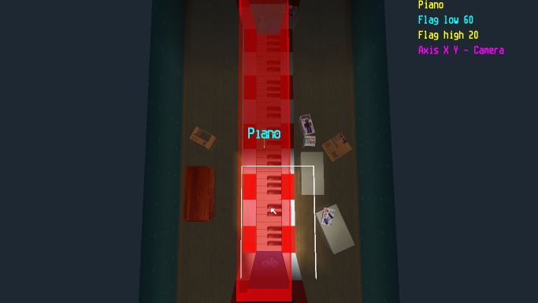

This trigger is used for the piano in Toy World 1.
**Usage**: For this trigger to work, it must cover the full piano area and the cars that drive on it. To use this trigger in a custom track, the piano must also be in the exact same position as it is in Toy World 1.
**Flag low**: Not used? (60 in Toy World 1)
**Flag high**: Not used? (20 in Toy World 1)

## B. Split

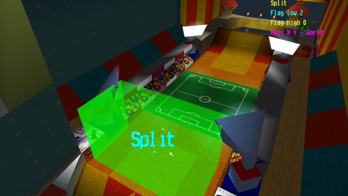  

This trigger is used for Time Trial mode. It displays the split time (how many seconds you are ahead or behind your record).
**Usage**: Place halfway through your track, or divide it into 'segments', placing one at the end of each. Note that crossing the start line will act the same way as touching a *Split* trigger.
**Flag low**: Used for order. Set to '0' for the first trigger you pass through, '1' for the second, ...
**Flag high**: Not used.

## C. Track dir

  
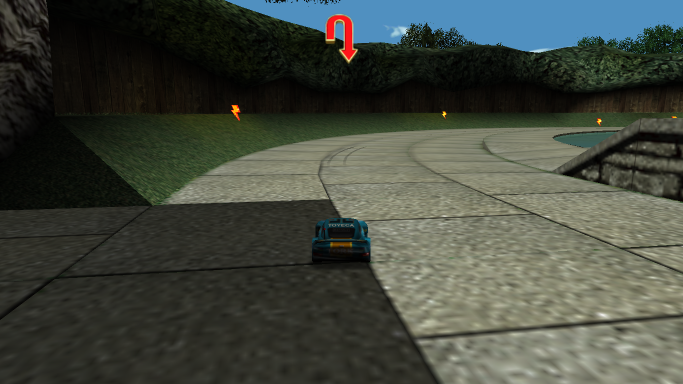

This trigger is the most important, because it tells players what the racing line is.
**Usage**: Place before each turn in your track and in sections you think might be confusing (such as two-way paths and intersections).
**Flag low**: Used for type. Here is a text/image list:
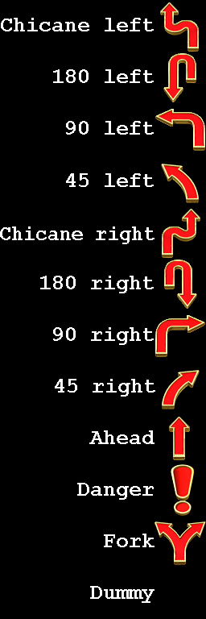
**Flag high**: Used for order. Set to '0' for the first trigger you pass through, '1' for the second... You can repeat numbers and use 'Dummy' triggers for multiple-way paths. Examples:

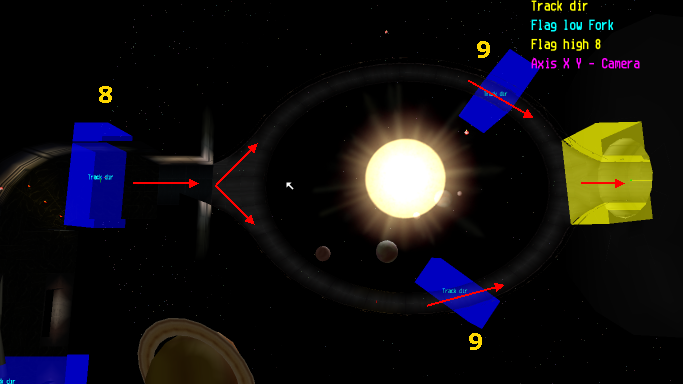  
  
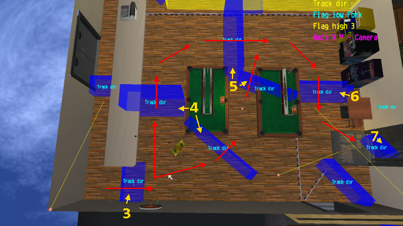

## D. CameraRail

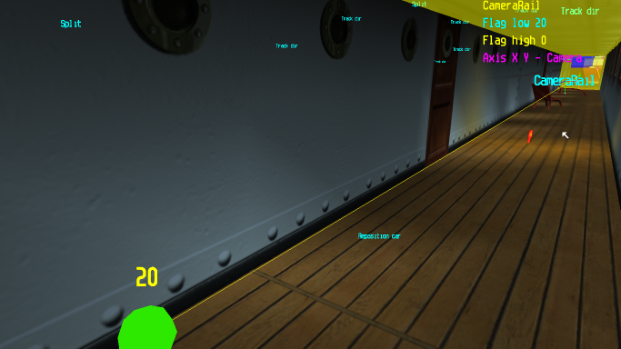

This trigger activates Rail cameras. More information is in the Camera Nodes tutorial.
**Usage**: Place this trigger covering the entirety of your Rail camera path. When a car enters it, the camera is activated. When it leaves, it is deactivated.
**Flag low**: The starting camera ID.
**Flag high**: Not used.

## E. AI Home

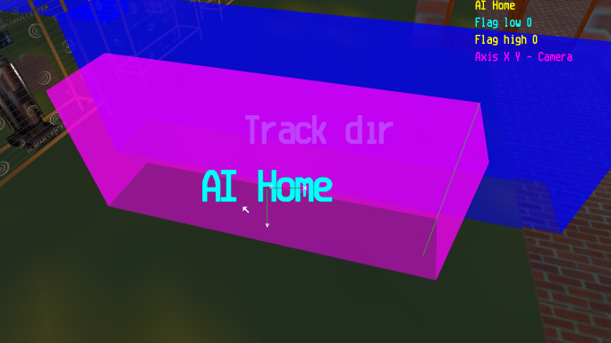  
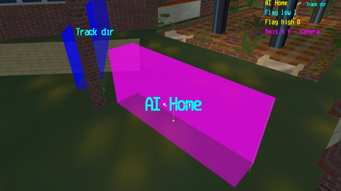  
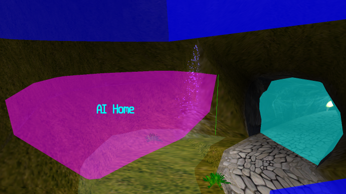

This trigger is not used in stock tracks and rarely used in custom ones. It does not appear to have any effect. It could be related to forcing AI cars back to the racing line. More testing is needed.
**Usage**: Unknown?
**Flag low**: Unknown. Makes a line go around the trigger when the value is '0' through '31'. Attempting to set it to '32' causes it to reset to '0'. In the custom track 'Human Center by human', there are two of these triggers (seen above, first two images). The first one has this value set to '0', the next one has it set to '1'. The motivation for this is unknown, as the value doesn't seem to affect anything.
**Flag high**: Unknown.

## F. CameraShorten

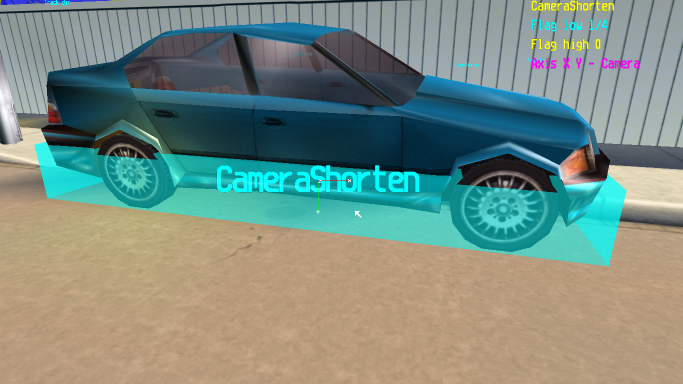  
  
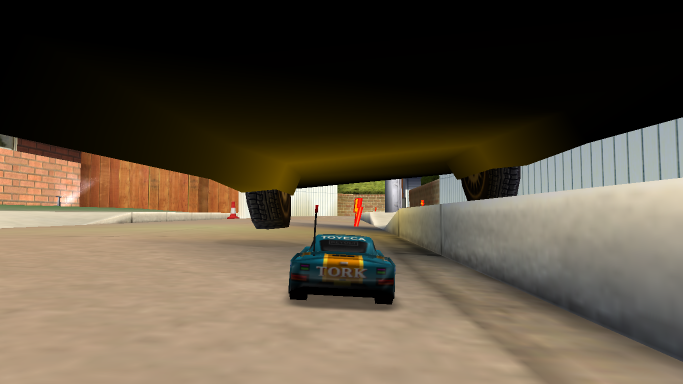

This trigger is used to make the camera go closer to the car.
**Usage**: Put in places with low ceilings. Can also be used on ramps, so that the view isn't so terrible.
**Flag low**: Sets how much the camera will be zoomed in (compared to original).
**Flag high**: Not used.

## G. Object Thrower

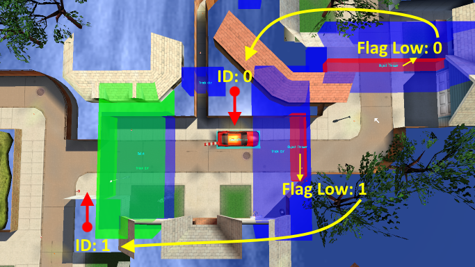

This trigger is used to activate 'Object Thrower' objects. For more information, visit the Objects tutorial.
**Usage**: When a car touches this trigger, the corresponding Object Thrower is activated.
**Flag low**: Set this to the ID of the Object Thrower to be activated.
**Flag high**: Not used.

## H. Gap Camera

**Usage**:
**Flag low**:
**Flag high**:

## I. Reposition Car

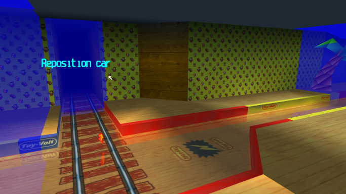

All cars that touch this trigger will be repositioned, as if the played had pressed their 'Reposition' button.
**Usage**: Place this trigger in an area you do not want the player to access, or where they would probably want to reposition as soon as possible. If you use this to block off access to locations, make sure that the area is clearly marked as 'out of bounds', otherwise, players will be confused.
**Flag low**: Not used.
**Flag high**: Not used.