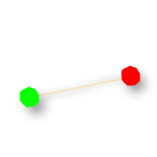
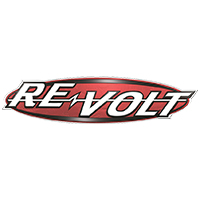
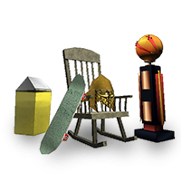
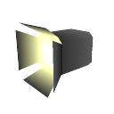

# MakeItGood

At this point you should be done modeling and texturing your track.

MakeItGood is a cheat code that enables you to access several different editing modes.

> To enable the edit modes: Launch Re-Volt in “-dev” mode (revolt.exe -dev). If you are using Re-Volt 1.2 or RVGL (which you should be), this is the way to go.

**Alternatively:** To get into each of the editing modes select Start Race from the main menu. Then select Single Race, and any game mode. Now put in “MAKEITGOOD” as a name and hit enter. After doing this you should hear a honking sound as it moves on to the car selection screen. Press Esc three times and it should take you back to the Race Type menu. At the bottom you will see a new option, Edit Mode. Select what edit mode you want. Once you get into the level, just follow the tutorial below for whatever mode your editing. You can start with POS Nodes, then continue with Track Zones and so on. Just follow the list of tutorials down below.

|   |  Edit Mode  |  Description  |
|  :-----          |  :-----          |  :-----          |
|  |  [POS Nodes](./01.pos-nodes) |  **POS Nodes** tell the Re-Volt engine about the race path, this includes distance your car is from the other cars in the race as well as the length of the track and what it takes to complete a lap on your track. Pos nodes will only define nodes, the orientation is given by Track zones. |
|  |  [Track Zones](./02.track-zones) |  **Track Zones** tell the Re-Volt engine what order the cars need to take around your track to make a complete lap. They work in conjunction with Pos Nodes & AI Nodes.Together with POS Nodes, they’ll determinate your position inside race path. |
|  |  [AI Nodes](./03.ai-nodes) |  **AI Nodes** are what the ai (computer) cars use to properly navigate the track. AI Nodes are mandatory in all tracks with the exception of battle levels and stunt tracks. |
|  |  [Force Fields](./04.force-fields) |  **Force Fields** push and pull by applying different forces to cars around the track depending on how you set your fields up. You can use these in a variety of ways to enhance the theme of your track. For whatever reason, the word force is spelled _Farce_ in the game. |
|  |  [Objects](./05.objects) |  **Objects** are 3D models with special features. This also includes the Pick-Ups which players get their weapons from. |
|  |  [Triggers](./06.triggers) |  **Triggers** allow you to put direction arrows and other things into your track. This will help people navigate your track. It’s also used for the piano in Toy World and for cameras. |
|  |  Camera Nodes |  **Camera Nodes** tell the Re-Volt engine where to place the cameras for replays, and what direction (order) they should travel. See TVTIME. |
|  |  Visiboxes |  **Visiboxes** will block out certain sections of your track while they are not in view, increasing the FPS (Frames Per Second) on your track, making the track a smoother racing experience |
|  |  Instances |  **Instances** are models that you (or other people) have created that you can insert into your track to enhance your overall theme. |
|  |  Lights |  Adding **lights** can help create a different mood for your track as well as the objects (such as cars) inside. |
|   |  Portals (Erm, nothing to see here) |  Not used in game. This mode was probably used for performance optimization, not teleportation. |

